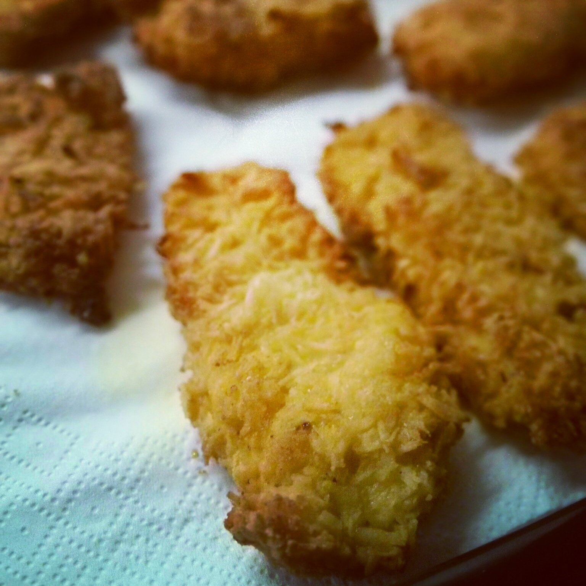
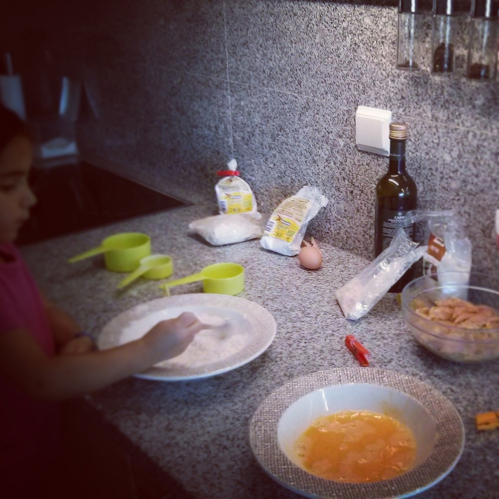
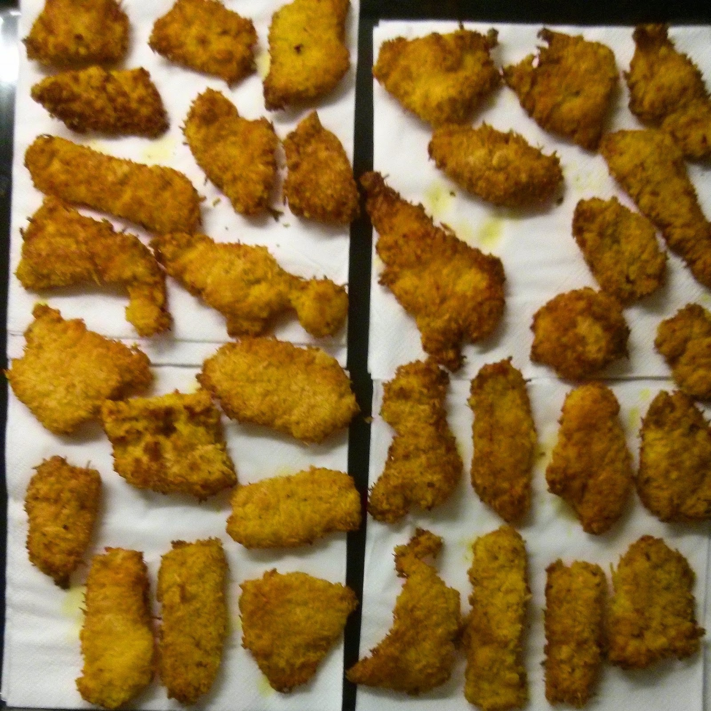
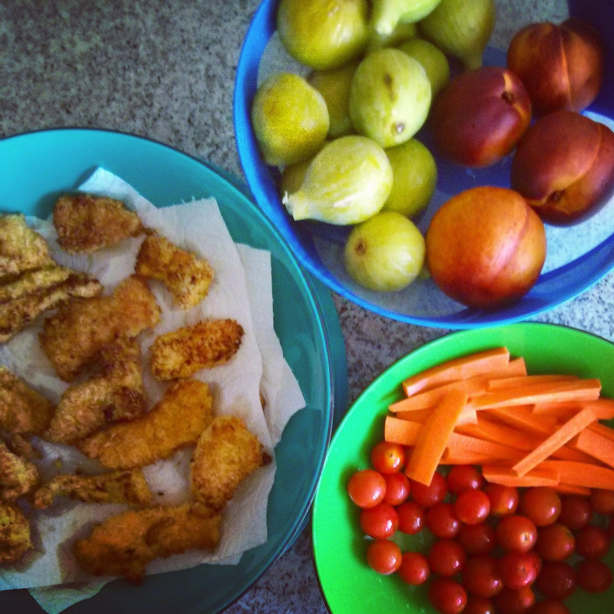
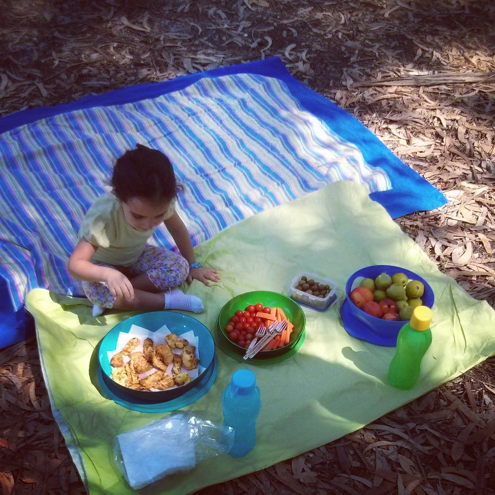

Em tempos já tinha feito um post sobre piqueniques e [panados](https://renatoalvestorres.net/2012/09/09/dia-493-panados/). Estou a partilhar esta receita um pouco à pressa porque uma amiga quer fazer um piquenique e necessita de saber como fazer panados numa versão mais saudável. Esta versão que se segue é bastante melhor do que a [anterior](https://renatoalvestorres.net/2012/09/09/dia-493-panados/). Fotos mais em baixo.  
  
**O que leva**  
\- Bifes de peru ou peitos de frango cortados em pedaços pequenos  
\- 1 Chávena de coco ralado  
\- 1 Chávena de farinha de coco (ou se não tiver farinha de milho)  
\- 2 Ovos  
\- Óleo de coco (ou se não tiver azeite)  
\- Curcuma  
\- Pimenta preta moída na altura  
\- Sal  
\- Sumo de limão  
  
**Como fiz**  

1. Temperar o frango com curcuma, pimenta, sal e sumo de limão. Reservar.
2. Bater dois ovos num prato ou taça.
3. Misturar a farinha e o coco ralado num prato.
4. Passar cada um dos pedaços de carne no ovo, sacudir bem e envolver na mistura de farinha/coco ralado.
5. Numa frigideira, fritar em óleo de coco, até a crosta ficar ligeiramente tostada.
6. Colocar numa grelha do forno à medida que se for tirando da frigideira. Retirar com cuidado para que a crosta não salte.
7. Levar ao forno (pré-aquecido a 175º) durante 10 a 15 minutos para acabar de cozinhar a carne.
8. Deixar arrefecer sobre papel absorvente.
9. Acompanhar no piquenique com tomates cereja pequenos, tiras de cenoura, azeitonas e fruta.

  

Os panados

  
  

A Inês a ajudar. Foi uma ajuda fantástica e um bom entretenimento para a manhã de sábado.

  

Um tabuleiro cheio. Chega e sobra para 2 adultos e uma criança de 4 anos.

  
  

A ementa completa (com excepção de umas azeitonas)

  

O início do piquenique

