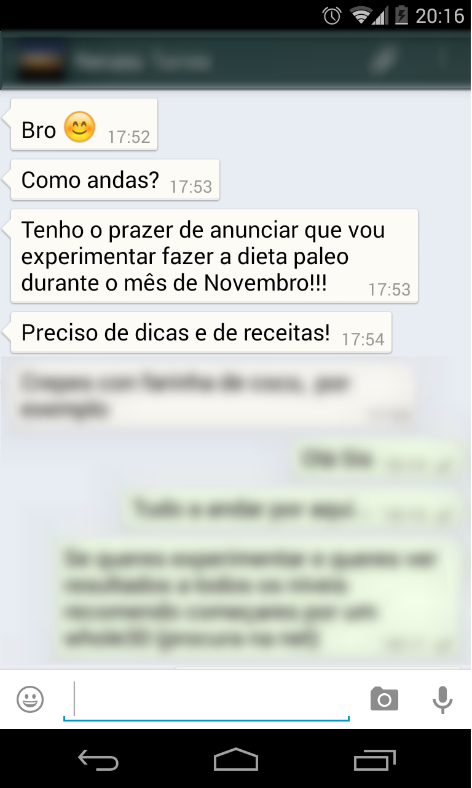

Tenho andado ausente do blog e mais activo no Instagram (podem seguir em [http://instagram.com/cozinhadecaverna](http://instagram.com/cozinhadecaverna)).  
  
Mas hoje, assim como aconteceu com a [Susana](https://renatoalvestorres.net/search/label/susana), ganhei uma motivação adicional para voltar a ser assíduo no blog. A minha irmã diz-me via WhatsApp:  
  

  

Combinámos fazer um [Whole30](http://whole30.com/), a começar no dia 1 de Novembro. Com este compromisso, resolvi escrever no _blog_ sobre estes 30 dias.

  

Este _post_ serve para me comprometer com mais pessoas e para responder a uma pergunta:

  

[.jpg)](http://1.bp.blogspot.com/-7aI6dE7kKVk/VE1Z8WaRKqI/AAAAAAAAULE/LN8O0nV5jfQ/s1600/Screenshot%2B(08_27pm%2BOct%2B26%2B2014).jpg)

  

Esta é uma pergunta certamente já muito respondida em livros e _blogs_ mas não posso dizer à minha irmã para ir ler outras fontes sem lhe transmitir a minha visão pessoal _express_.

  

Mana, aqui vai:

  

Em primeiro lugar, "isto" não é uma dieta. As dietas normalmente são prescritivas e difíceis de seguir. Considera "isto" uma abordagem ou _framework,_ em que esqueces os gurus das dietas e voltas ao básico, seguindo aquilo que o teu corpo de indica.

  

A forma mais resumida que tenho de explicar é: "come comida de verdade".

  

O que é "comida de verdade" para nós seres humanos? Para mim é isto:

  

**Comer comida verdadeira, não processada, o mais natural possível.**

Fingir que o supermercado não existe. Escolher alimentos que possam ser cultivados, caçados ou apanhados - excluir os refinados ou altamente processados

  

Comer animais, peixes, vegetais, nozes, sementes e fruta.

  

Comer gorduras saudáveis de animais de pasto, peixe, coco, abacate, azeitonas e óleos extraídos a frio.

Beber água.

Incorporar alimentos tradicionais, densos em nutrientes: vegetais fermentados, orgãos e caldos caseiros.

  

Tendo em conta esta abordagem, e respondendo à questão original, em primeiro lugar livro-me de tudo o que não encaixe no que descrevi em cima (pão, massas, arroz, açúcar, doces, bebidas, etc.). Depois compro os seguintes produtos (de preferência biológicos, consoante a disponibilidade dos mesmos e a minha disponibilidade financeira):

1. Ovos, carne e peixe (fresco, congelado e enlatado)
2. Frutos secos (amêndoas, nozes, avelãs e castanha do brasil)
3. "Vegetais" (saladas prontas a consumir, brócolos, couves, alho francês, alface, cebola, courgette, abóboras, tomates, etc.)
4. Tubérculos e raízes (cenouras, batata doce, etc.)
5. Fruta (bananas da madeira, maçãs, laranjas, etc.)
6. Gorduras (óleo de côco, azeite virgem extra, manteiga clarificada, [banha de porco preto biológico](https://renatoalvestorres.net/2013/02/02/dia-640-banha-da-meia-noite-midnight-lard/))
7. Ervas aromáticas (salsa, coentros, etc.)
8. Especiarias e temperos (sal, pimenta, curcuma, gengibre, alho, etc.) 

  

Com estes ingredientes em casa, só tens que:

1. Comer comida "normal" a todas as refeições, inclusive ao pequeno-almoço (podes cozinhar em grandes quantidades e congelar). 
2. Comer sempre até estares saciada.
3. Se tiveres fome entre as refeições principais, levar contigo ovos cozidos, vegetais crus (cenoura, aipo, pepino, etc.), batata doce assada, fruta e alguns frutos secos. Podes também fazer carne seca ([peru](https://renatoalvestorres.net/2013/09/09/dia-858-jerky-de-peru/) ou [vaca](https://renatoalvestorres.net/2012/03/25/dia-325-o-meu-primeiro-jerky-carne-seca/)).

  

Um exemplo prático: amanhã as minhas refeições vão ser:  

1. **Pequeno-almoço**: hamburger de vaca grelhado com salada de tomate e orgãos
2. **Meio da manhã**: banana e 10 amêndoas
3. **Almoço**: peixe grelhado com salada ou vegetais cozidos
4. **Meio da tarde**: maçã
5. **Jantar**: caldo verde e peixe assado no forno com batata doce e salada.

  

Vamos a isso!!!
