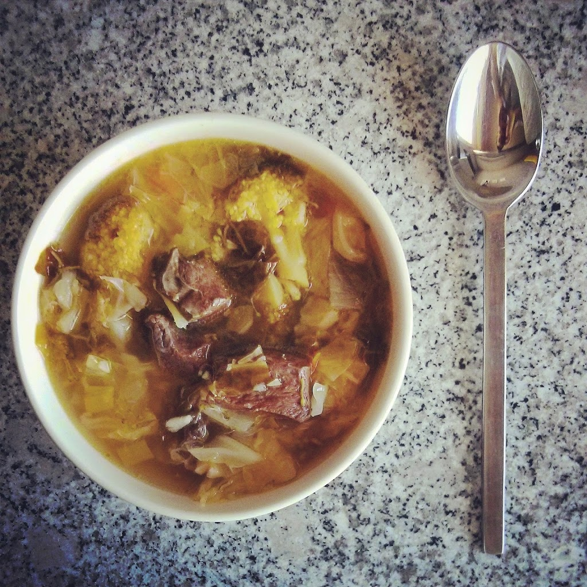
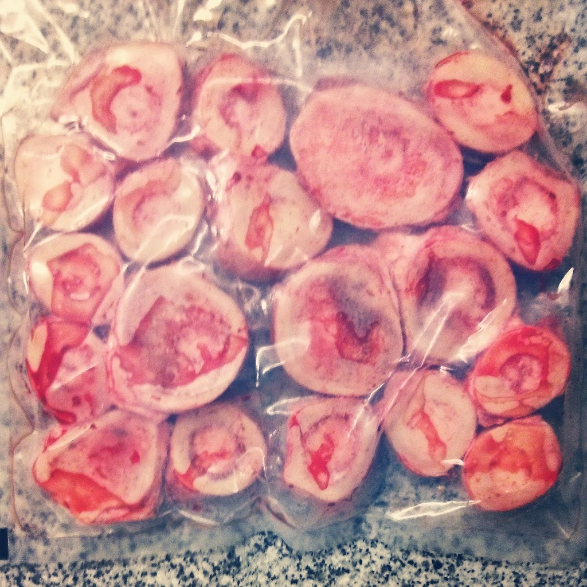
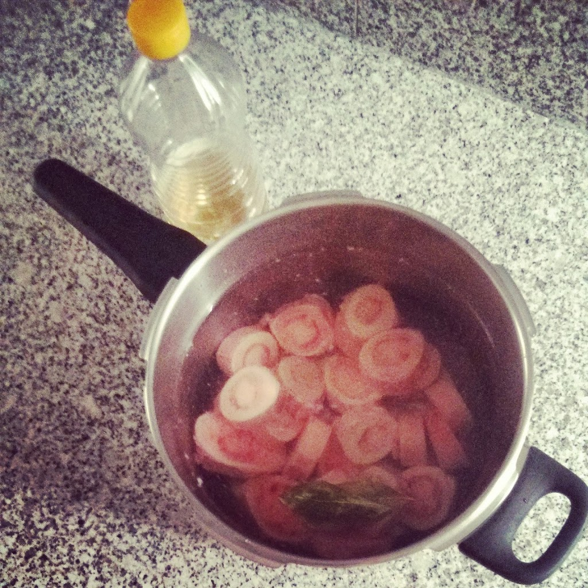
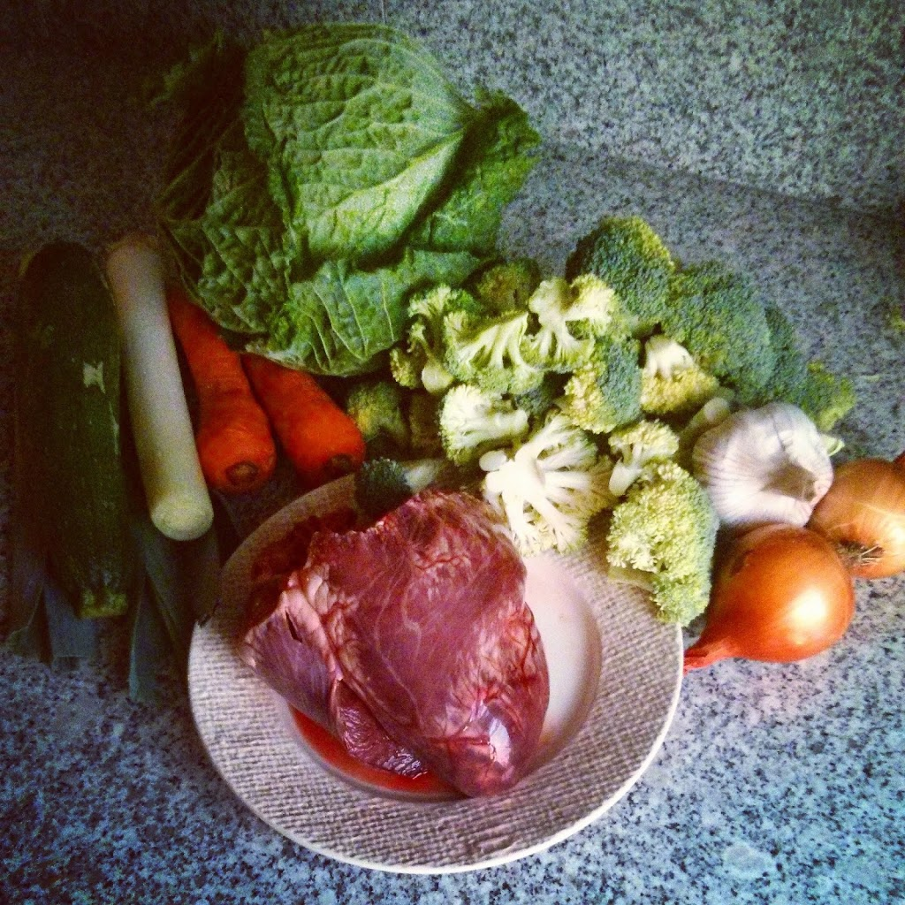
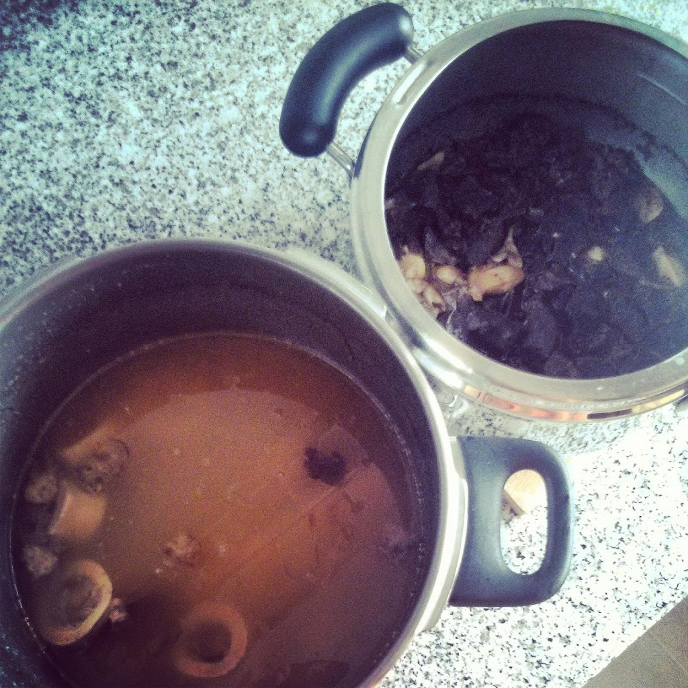

Queria fazer este Whole30 (comecei no dia 1 de Novembro) e variar um pouco mais ao pequeno-almoço. Por isso decidi fazer um caldo de ossos para servir de base para uma sopa de coração de vaca e vegetais, que posso congelar e comer durante uma série de dias. Seguem receitas resumidas e fotos do processo.

  

**O Caldo**

Encontrei uma receita básica de caldo: [ossos do tutano](http://solardagiesteira.pt/?product=ossos-do-tutano), água, 1 colher de sopa de vinagre e folhas de louro dentro da panela de pressão a cozinhar durante 3 horas. No final, coar para retirar os resíduos e ficar apenas o caldo limpo.

  

**O Coração**

Arranjar o [coração de vaca/vitela](http://solardagiesteira.pt/?product=coracao) se não vier arranjado, cortando o mesmo em cubos. Cozinhar numa panela de pressão durante 1h30 com um pouco de água, sal, pimenta, alhos descascados e louro.

  

**A Sopa**

Cortar cenoura às rodelas, brócolos aos pedaços e o repolho às tiras. Numa panela fazer um refogado com azeite, cebola e alhos. Adicionar os vegetais (começar pela cenoura, repolho e por fim os brócolos) e saltear durante uns minutos. Adicionar o caldo e água, rectificando todos os temperos. Adicionar a carne e deixar cozinhar até os vegetais estarem tenros. Deixar arrefecer e congelar (eu não resisti em comer logo uma "malga" de sopa acabada de fazer).

**O resultado final**

  

**Ossos do Tutano (menos de 2€/kg)**

  

**A preparação para o caldo**

  

**Vegetais (podem escolher os que quiserem) e o Coração (menos de 3€/Kg)**

  

**Coração e o caldo prontos**

