Nesta época natalícia, ando a procurar e a experimentar receitas que me permitam "sair da linha" sem grandes estragos. Confesso que não vou deixar de comer as filhoses da minha mãe, cheias de mel e trigo, porque para além de fantásticas, fazem parte do um legado familiar e de uma tradição incontornável. No que toca ao resto vou ser mais restritivo.  
  
Encontrei uma [receita de tarde de maçã](http://autoimmune-paleo.com/classic-apple-pie/) no _site_ Autoimmune Paleo que resolvi experimentar. Deixo a receita em Português e fotografias do processo.  
  

[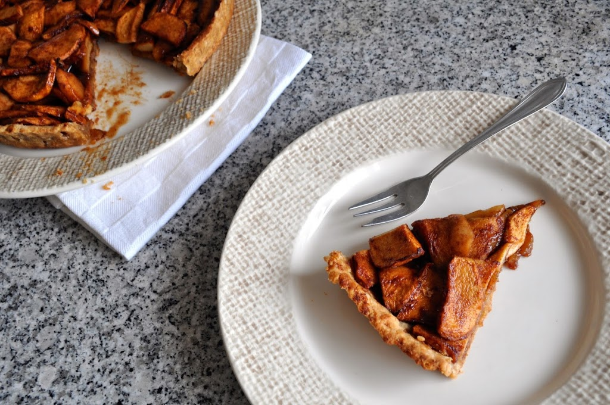](https://renatoalvestorres.net/wp-content/uploads/2014/12/DSC_1832.jpg)

  
  

Para fazer a base

[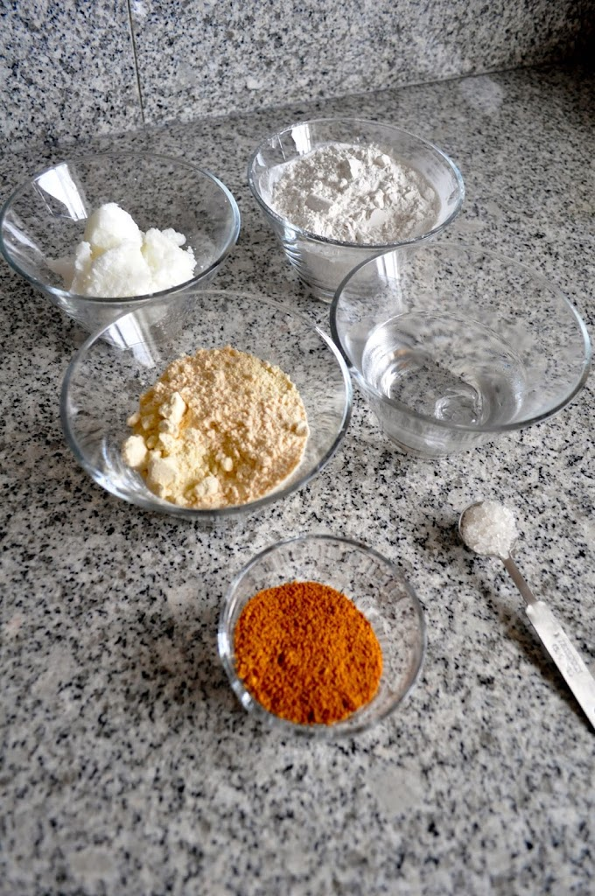](https://renatoalvestorres.net/wp-content/uploads/2014/12/DSC_1749.jpg)

  

[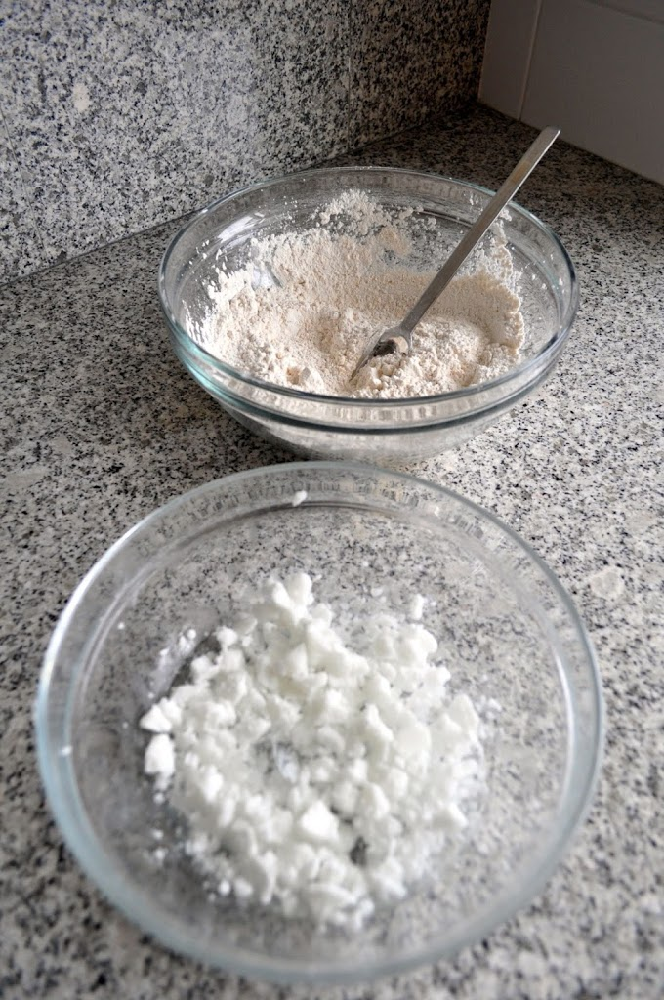](https://renatoalvestorres.net/wp-content/uploads/2014/12/DSC_1752.jpg)

  

[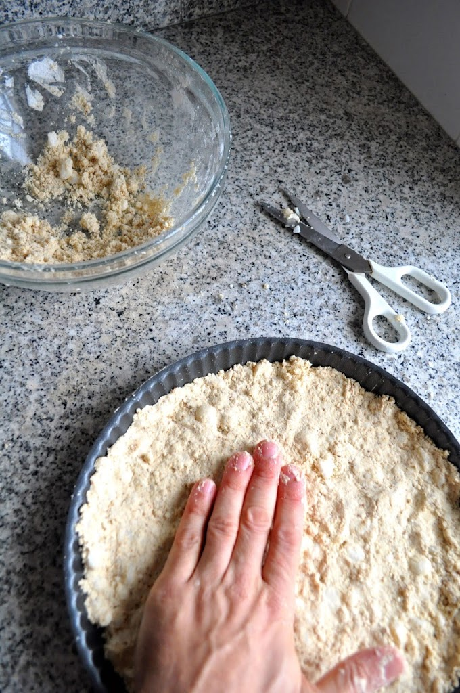](https://renatoalvestorres.net/wp-content/uploads/2014/12/DSC_1756-2.jpg)

  

[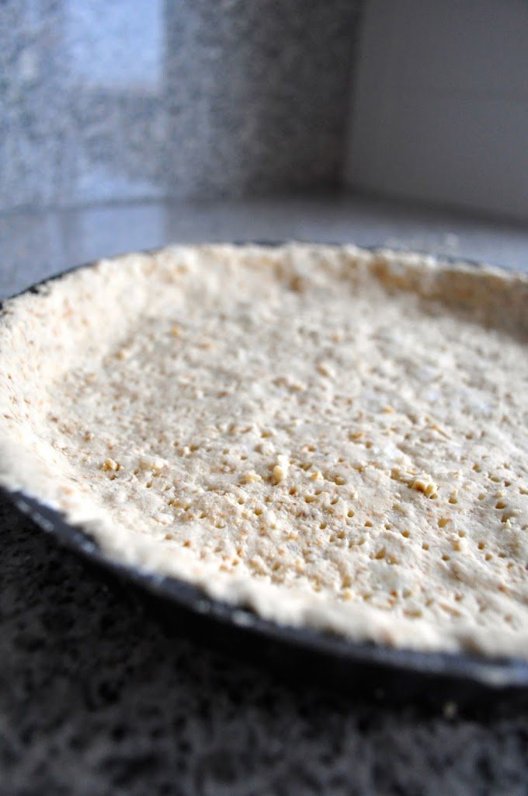](https://renatoalvestorres.net/wp-content/uploads/2014/12/DSC_1768.jpg)

  

Para o recheio

[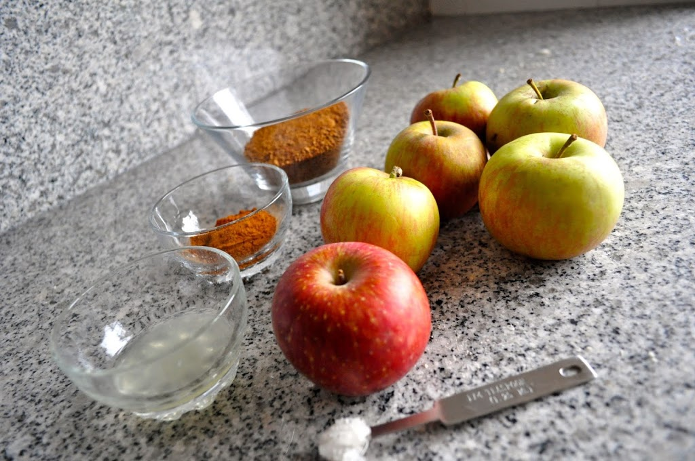](https://renatoalvestorres.net/wp-content/uploads/2014/12/DSC_1774.jpg)

  

[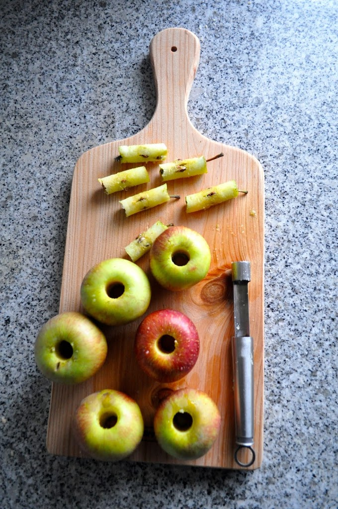](https://renatoalvestorres.net/wp-content/uploads/2014/12/DSC_1778.jpg)

  

[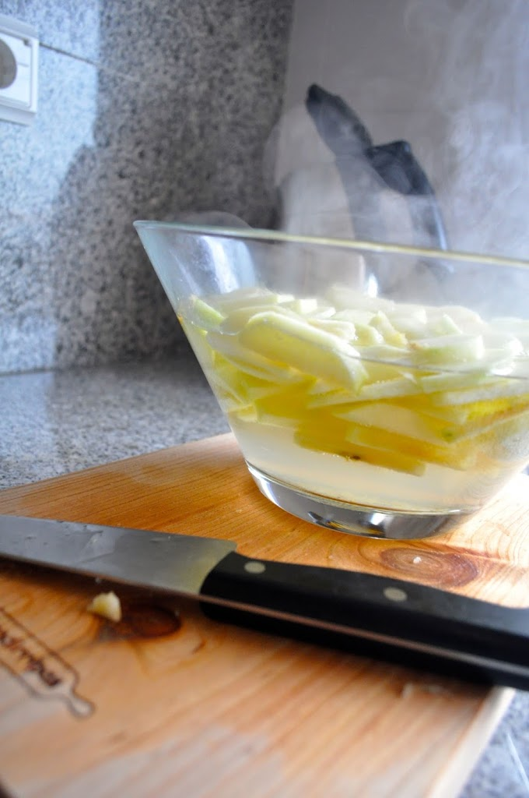](https://renatoalvestorres.net/wp-content/uploads/2014/12/DSC_1782.jpg)

  

[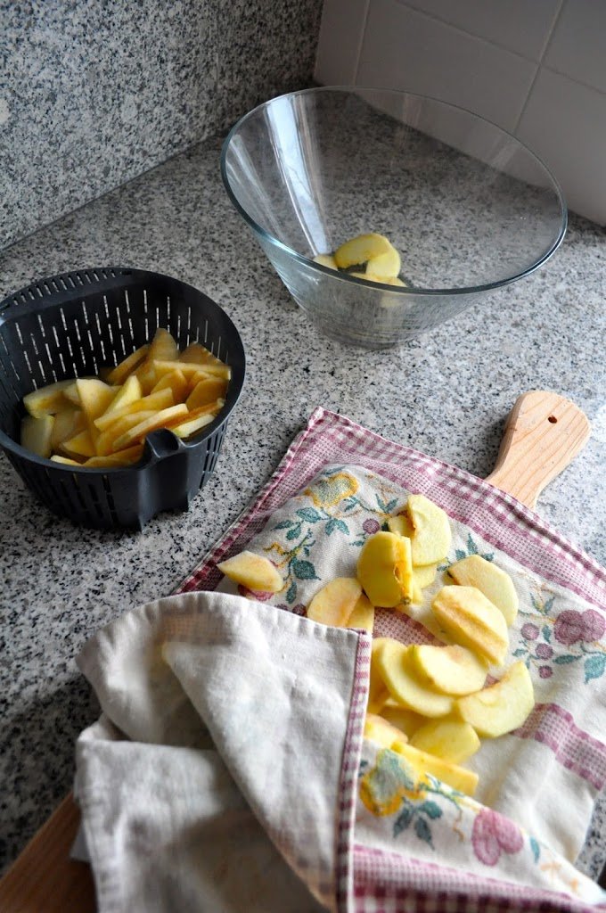](https://renatoalvestorres.net/wp-content/uploads/2014/12/DSC_1787.jpg)

  

[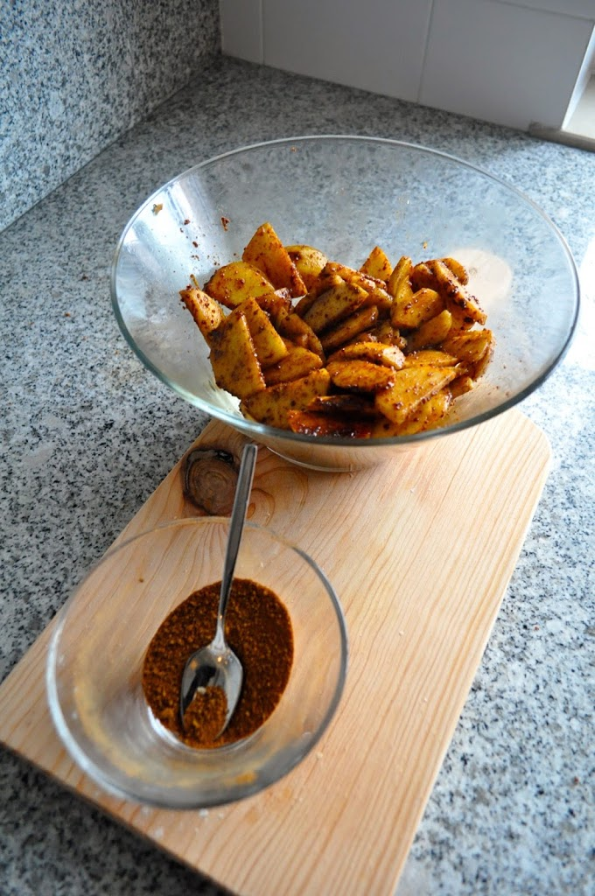](https://renatoalvestorres.net/wp-content/uploads/2014/12/DSC_1790.jpg)

  

[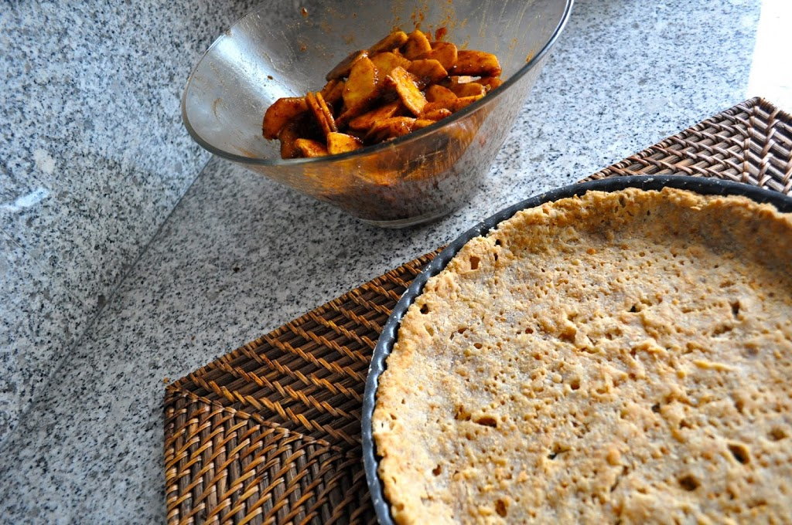](https://renatoalvestorres.net/wp-content/uploads/2014/12/DSC_1796.jpg)

  

[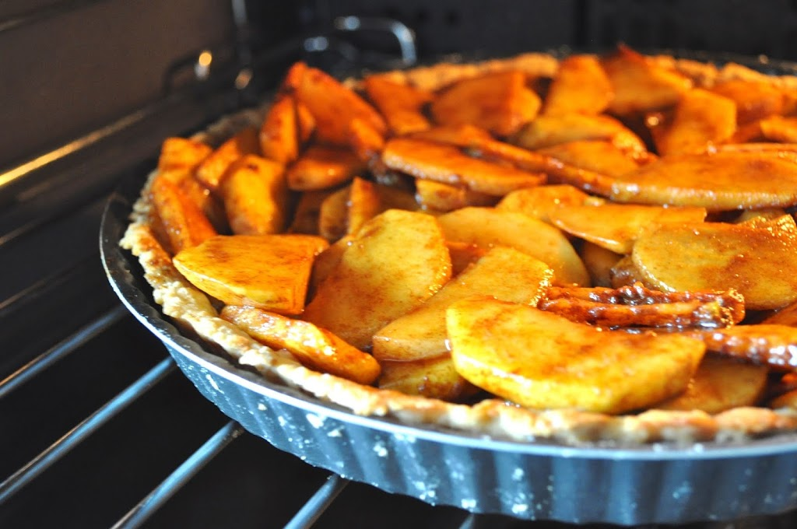](https://renatoalvestorres.net/wp-content/uploads/2014/12/DSC_1810.jpg)

  

[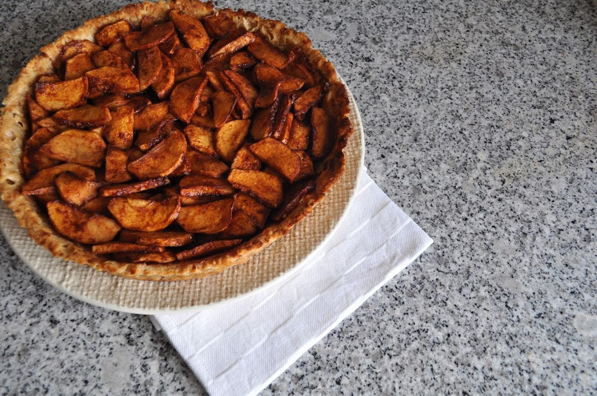](https://renatoalvestorres.net/wp-content/uploads/2014/12/DSC_1827.jpg)

  

**Ingredientes da base**

- 1 chávena de farinha de araruta
- ½ chávena de farinha de coco
- 2 c. sopa de açúcar de coco
- ¼ c. chá de sal
- ¾ chávena de óleo de coco, frio
- ½ chávena de água, fria

  
**Ingredientes do recheio**  

- 5 maças, descascadas, sem centros, cortadas em fatias finas
- ½ chávena de açúcar de coco
- 1 c. sopa de canela
- ¼ c. chá de sal
- sumo de ½ limão

**Instruções**

1. Aquecer o forno a 175º C.
2. Para fazer a base, combinar a farinhas de araruta, coco, açúcar e sal numa taça.
3. Usando uma faca, cortar o óleo de coco em pedaços do tamanho de ervilhas. Juntar água fresca e misturar gentilmente tudo. 
4. Colocar a mistura numa tarteira. Com os dedos, espalhar a massa uniformemente no fundo e nos lados.
5. Picar a massa com um garfo, com cuidado para não descolar da tarteira.
6. Cozinhar por 15 minutos e reservar enquanto se prepara o recheio.
7. Colocar as fatias de maçã numa taça.
8. Aquecer água numa cafeteira eléctrica ou panela. A quantidade de água deve chegar para submergir as maçãs.
9. Quando a água estiver quente, juntar às maçãs até estas estarem cobertas. Deixar as maçãs na água quente durante 8 minutos, escorrer e reservar.
10. Secar as maças com uma toalha.
11. Combinar o açúcar com a canela e o sal numa taça grande e misturar gentilmente as maças.
12. Colocar a mistura na base.
13. Salpicar a tarte com o sumo do limão e cozinhar no  forno durante 30 a 35 minutos, até a crosta estar dourada.
14. Deixar arrefecer 10-15 minutos e servir.

  
**Notas Extra**  

1. Usei uma forma para tarde com o fundo amovível. **Foi um grande erro**. O óleo de coco ao derreter aquando da cozedura da base, escorreu para fora da forma. Consequências: forno cheio de fumo e a base mais seca pois perdeu parte da gordura.
2. Cortar o óleo de coco em pedaços realmente pequenos (tamanho de uma ervilha) para que a base não fique com furos quando este derreter.
