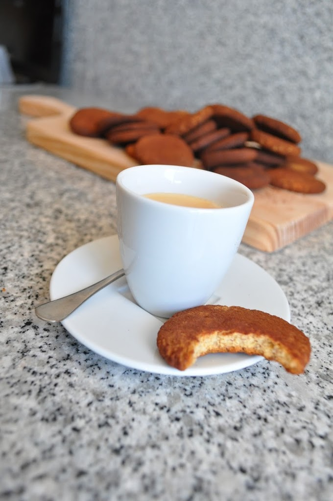
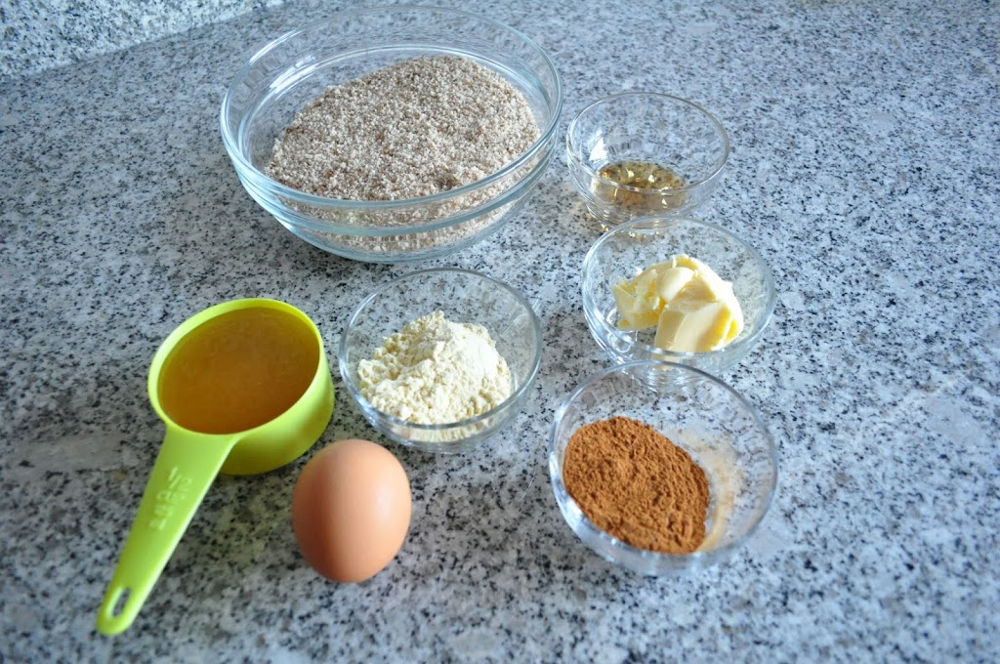
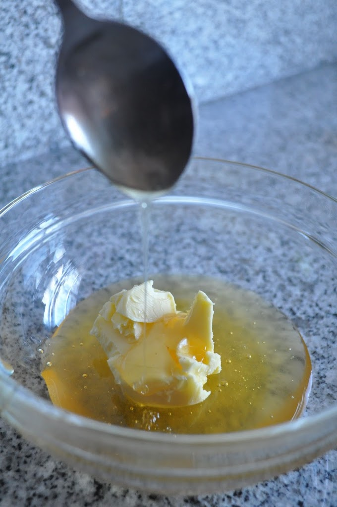
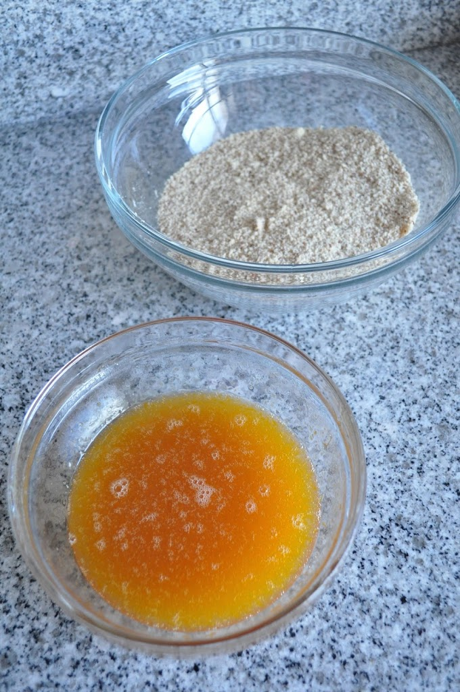
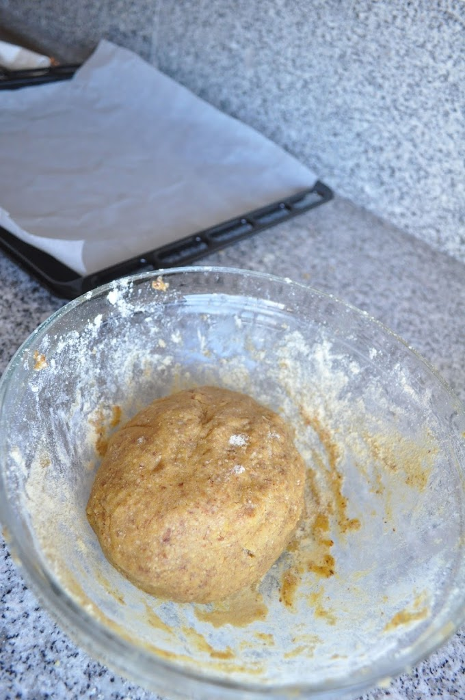
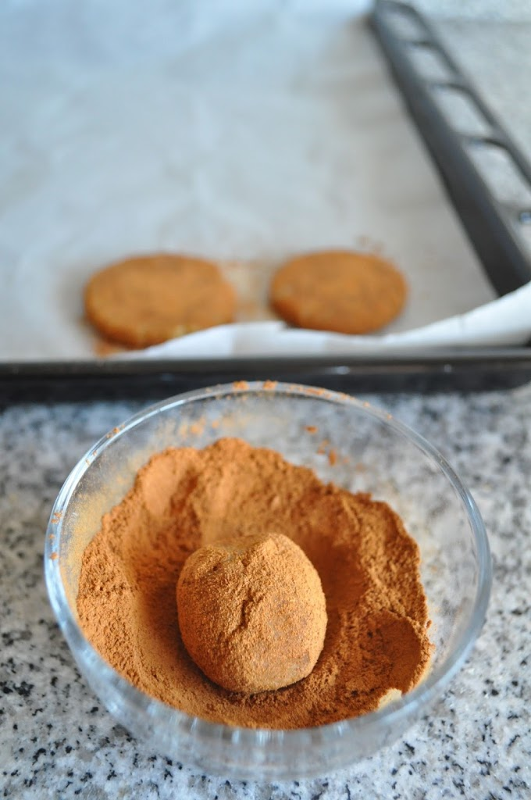
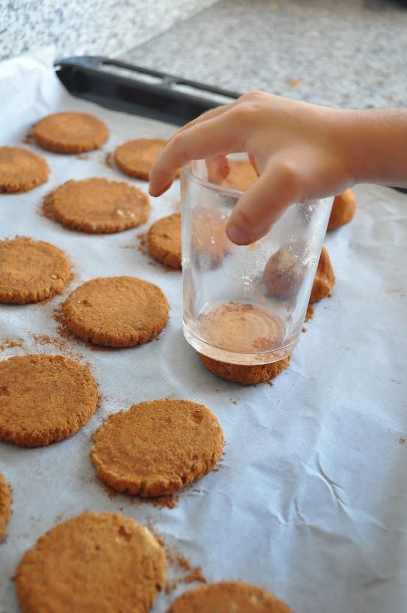
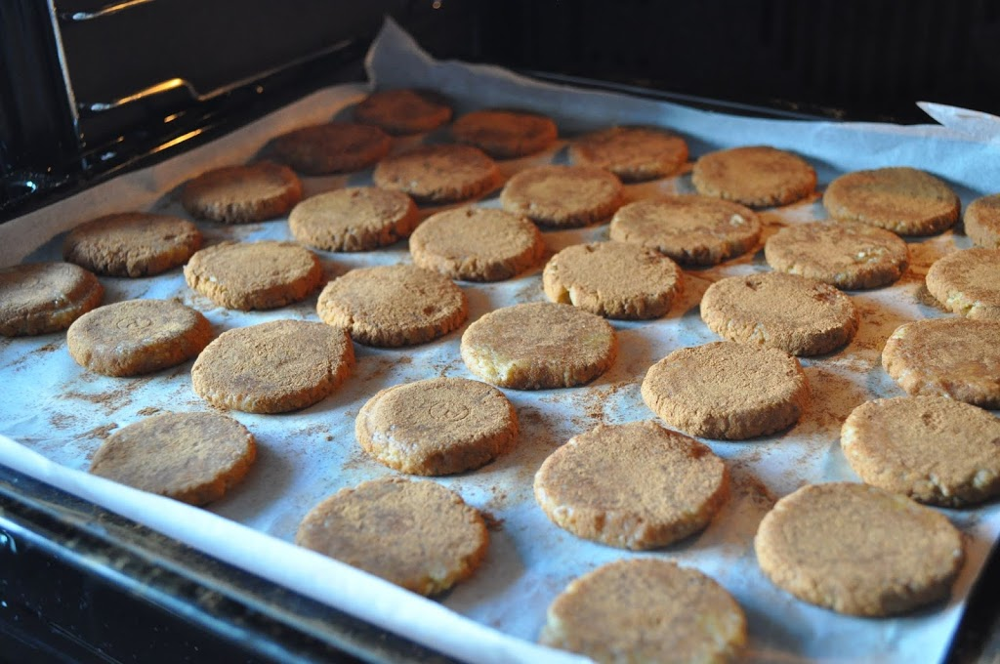

Mais uma receita para "sair da linha" no Natal sem grandes estragos. Desta vez bolachas de canela, óptimas para acompanhar café ou uma chávena de chá com a lareira acesa. 

  

São muito simples de fazer e permitem ter a participação de crianças no processo (a Inês, que agora tem 4 anos, ajudou-me a fazer estas). Deixo fotos e a receita no final do _post_. Podem ver a [versão original](http://slimpalate.com/snickerdoodles-paleo-grain-free-gluten-free/) no _site_ do Slim Palate.

  

A prova

  

Ingredientes

  

Ingredientes secos misturados, com a ajuda da Inês

  

Mel e a manteiga (pode ser substituída por óleo de coco ou manteiga clarificada)

  

Ingredientes líquidos e sólidos antes de serem misturados

  

Massa final

  

Fazer bolas de massa e passar por canela

  

Espalmar a bolas com a ajuda de um copo (e da Inês mais uma vez)

  

Rendeu 33 bolachas

  

  

**Ingredientes**  
  

- 2 chávenas de farinha de amêndoa (demasiado cara para comprar, fiz em casa triturando amêndoa na bimby)
- 5 c. sopa de farinha de coco 
- 1/4 de chávena de manteiga (ou óleo de coco ou manteiga clarificada)
- 1 ovo
- 1 c. chá de extrato de baunilha
- 1/4 c. chá de fermento em pó
- 1/4 c. chá de sal
- 1/2 chávena de mel
- 2 c. sopa de canela

**Instruções**

1. Aquecer o forno a 185ºC
2. Numa taça grande misturar a farinha de amêndoa, a farinha de coco, o sal e o fermento em pó.
3. Numa taça média misturar a manteiga, mel, o ovo e o extracto de baunilha. Se a manteiga estiver muito rija, aquecer um pouco em banho maria ou no microondas. 
4. Juntar a mistura líquida às farinhas e misturar bem. Se a massa não ficar moldavel e se pegar muito às mãos, juntar colheres de sopa de farinha de coco até atingir a consistência desejável.
5. Fazer bolas do tamanho de nozes e passar as mesmas por canela.
6. Colocar as bolas num tabuleiro previamente forrado com papel vegetal.
7. Espalmar as bolas com a ajuda de um copo.
8. Cozinhar no forno durante 10 a 15 minutos. As minhas ficaram 15 minutos e acho que foi em demasia. Ao fim de 10 minutos retirar uma bolacha e provar para ver como está de consistência.
9. Deixar arrefecer durante 15 minutos.
