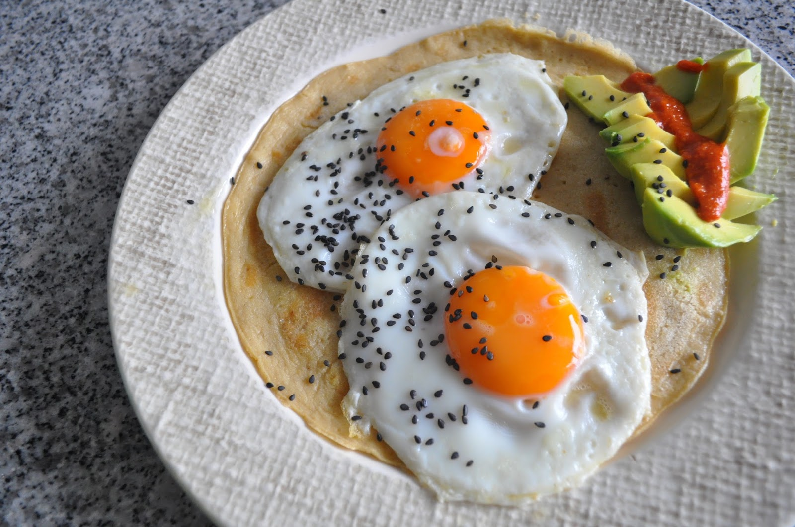

Hoje, inspirado por um [_post_](http://instagram.com/p/x96Ks6Kavi) no _instagram_ fiz ovos estrelados em cima de [crepes de araruta](https://renatoalvestorres.net/2014/04/13/dia-1074-crepes-de-farinha-de-araruta-e-coco/), salpicados com sementes de sésamo pretas, acompanhados de pêra abacate e molho picante caseiro.

  

