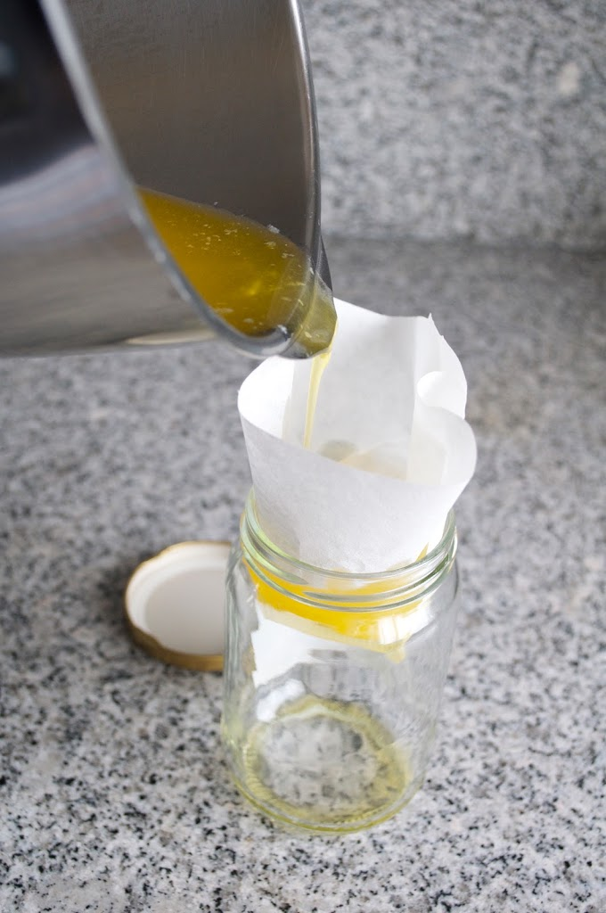

Ando sempre à procura da receita de manteiga clarifica para a bimby, que é bastante simples:  
  

1. Colocar manteiga sem sal no copo cortada em pedaços e programar 10 min, 60º e velocidade 1.
2. Coar a manteiga com a ajuda de um coador fino e um pano de algodão para dentro de um frasco 

Algumas notas pessoais:

- Tenho dificuldade em arranjar manteiga dos Açores sem sal pelo que fiz com a versão salgada.
- Não tenho coador fino e panos de algodão. Usei filtros de café.

Aqui ficam algumas fotos do processo:

  

  

  

  

  

  

  

  

  

  

  

