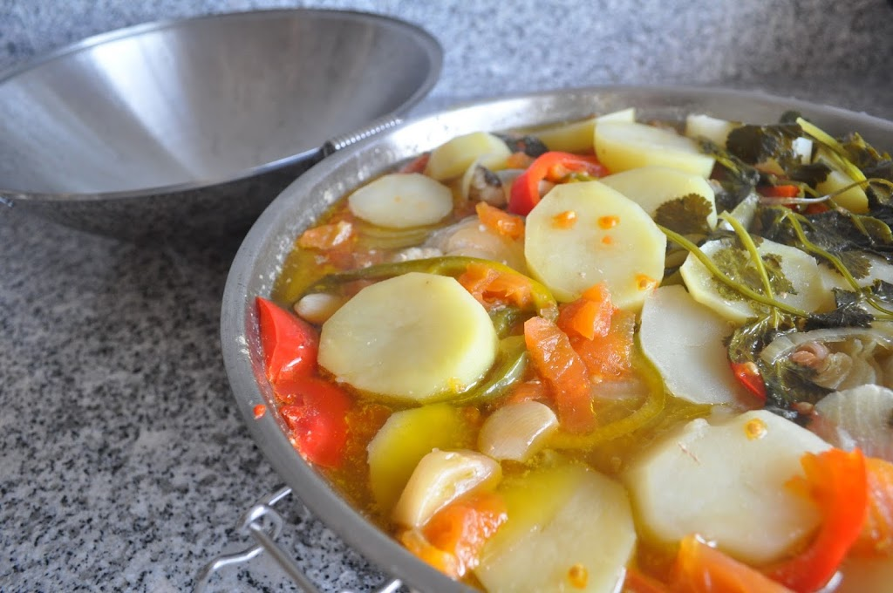
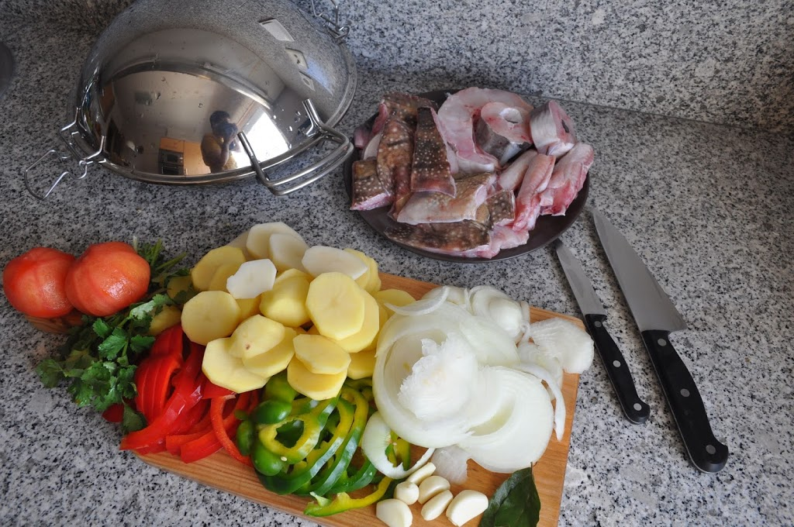
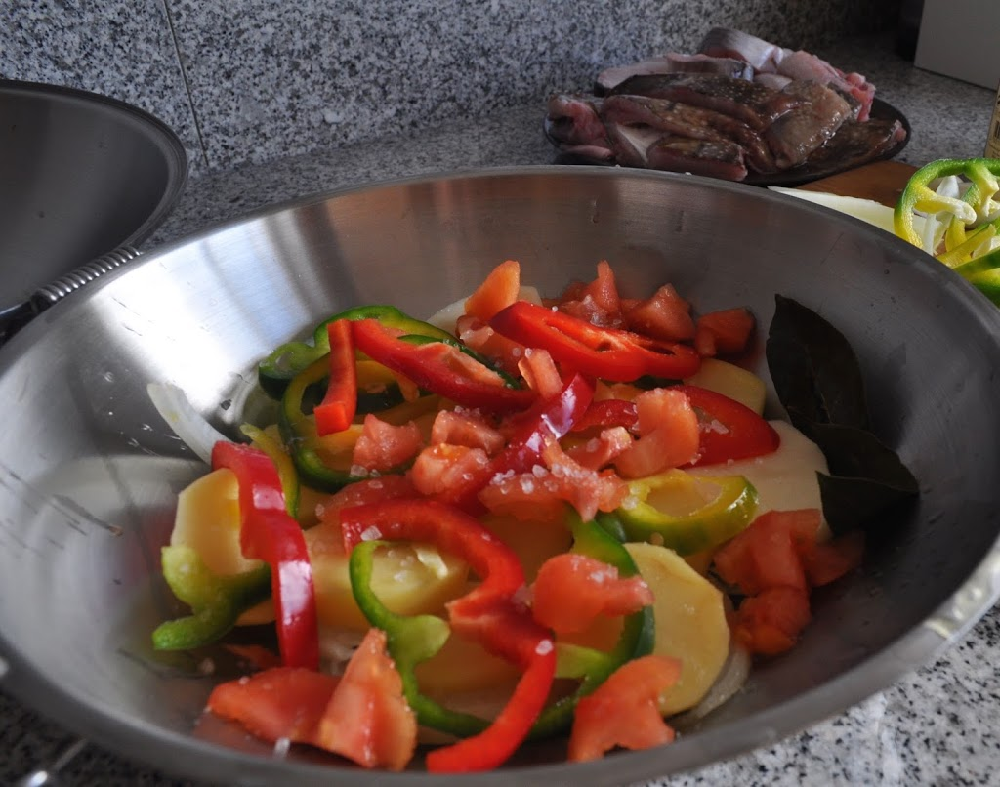
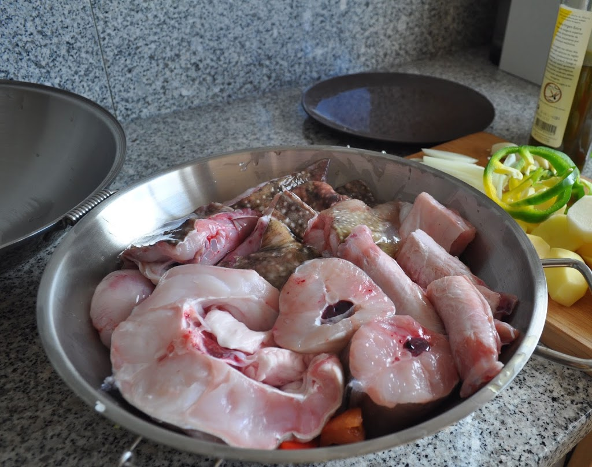
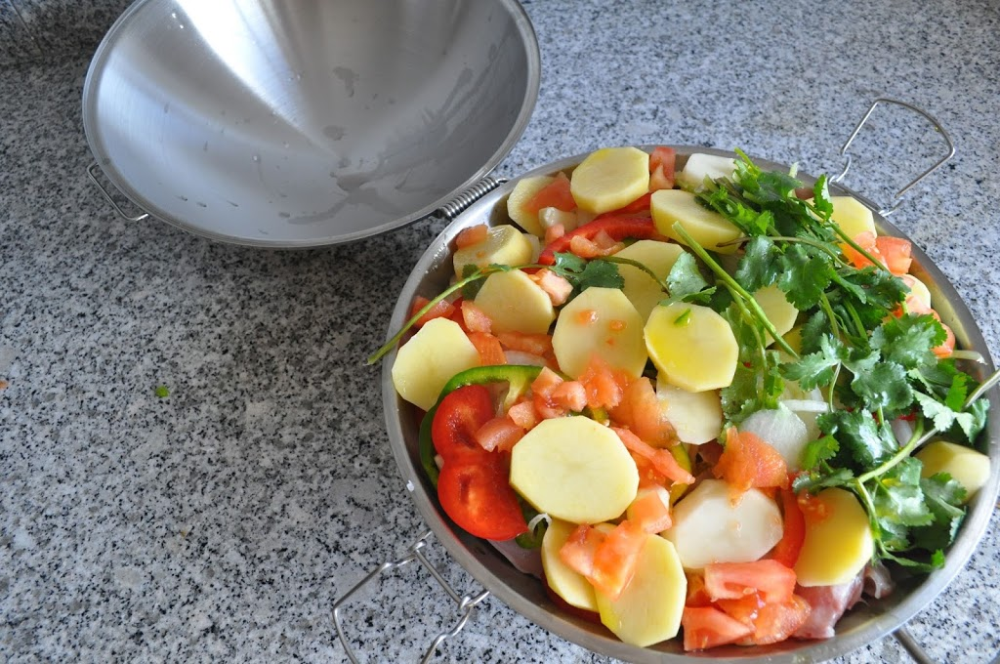
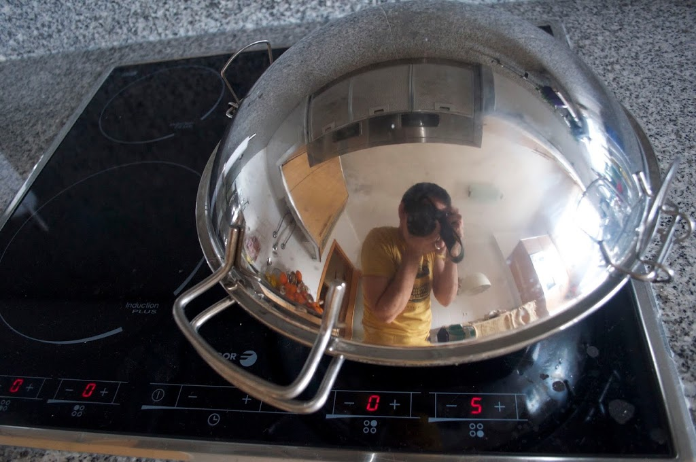
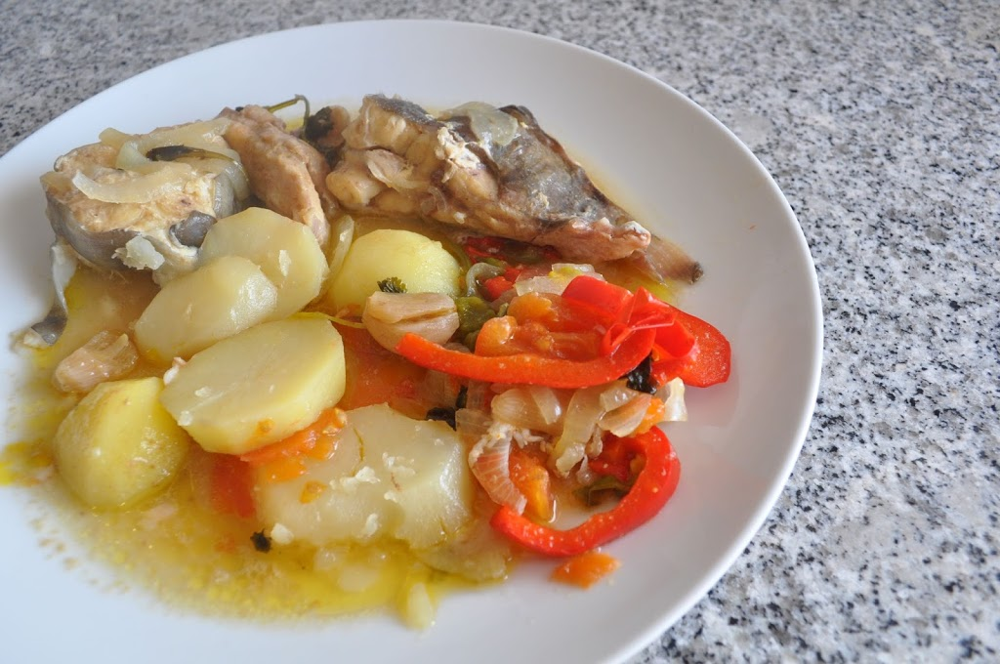

Tenho uma cataplana em casa desde que casei e confesso que nunca a tinha usado. Ontem comprei peixe para caldeirada e resolvi usar no almoço de hoje.  
  
  
  
Este é um prato muito simples de fazer e o sabor é fantástico. Além disso é compatível com o Whole30. As receitas típicas normalmente levam vinho branco, que pode não ser colocado.  
  
**O que levou**  
Cá em casa eramos três:  

- Peixe para caldeirada (eu tinha raia, safio e outro do qual não me recordo o nome)
- 5 batatas
- 2 tomates
- 1 pimento vermelho
- 1 pimento verde
- 5 dentes de alho
- 1 ramo de coentros
- 2 folhas de louro
- sal
- azeite

**Como fiz**

1. Descascar e cortar as batatas em rodelas grossas
2. Cortar os pimentos às rodelas
3. Cortar a cebola às rodelas
4. Retirar a pele e as sementes ao tomate  e cortar em cubos
5. Descascar os dentes de alho
6. Lavar o peixe
7. Colocar um fio de azeite no fundo da cataplana, seguido de uma camada de cebola, tomate, pimentos, batatas e os dentes de  alho
8. Colocar as folhas de louro
9. Temperar com sal
10. Colocar o peixe e temperar com sal
11. Colocar uma nova camada de cebola, tomate, pimentos e batatas
12. Temperar com sal
13. Adicionar o ramo de coentros
14. Cozinhar em lume brando durante 45 minutos sem abrir a cataplasma
15. Agitar a cataplana de vez em quando para que os ingredientes não peguem

  

  

  

  

  

