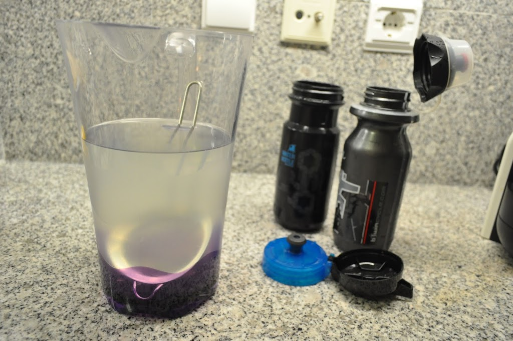
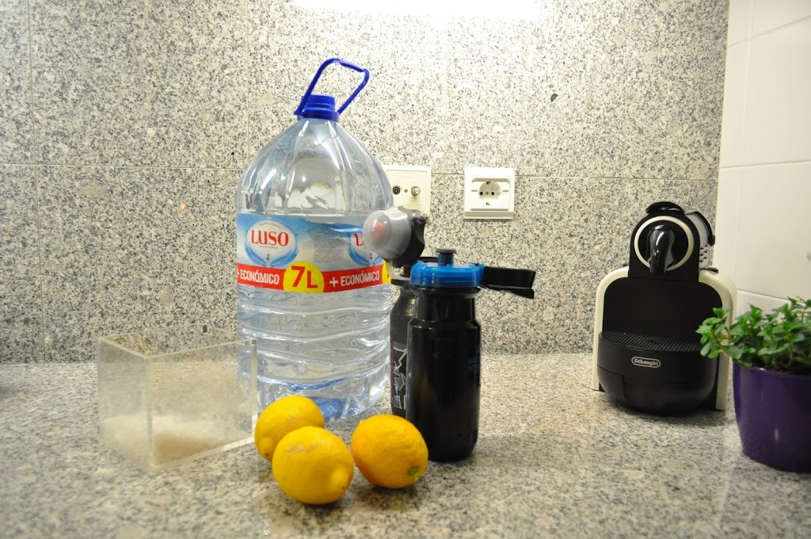
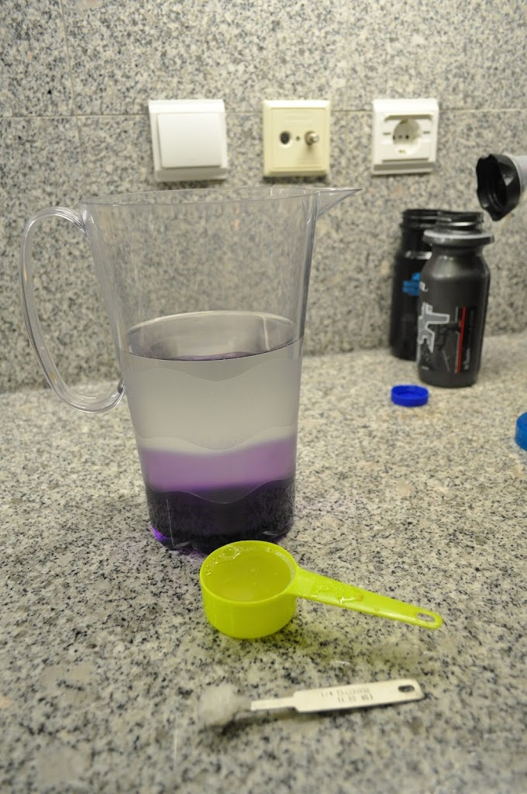
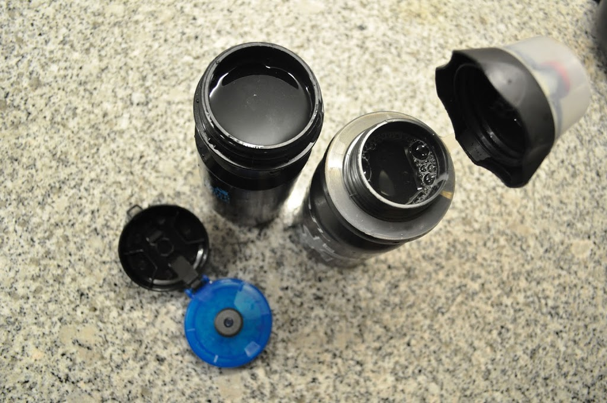
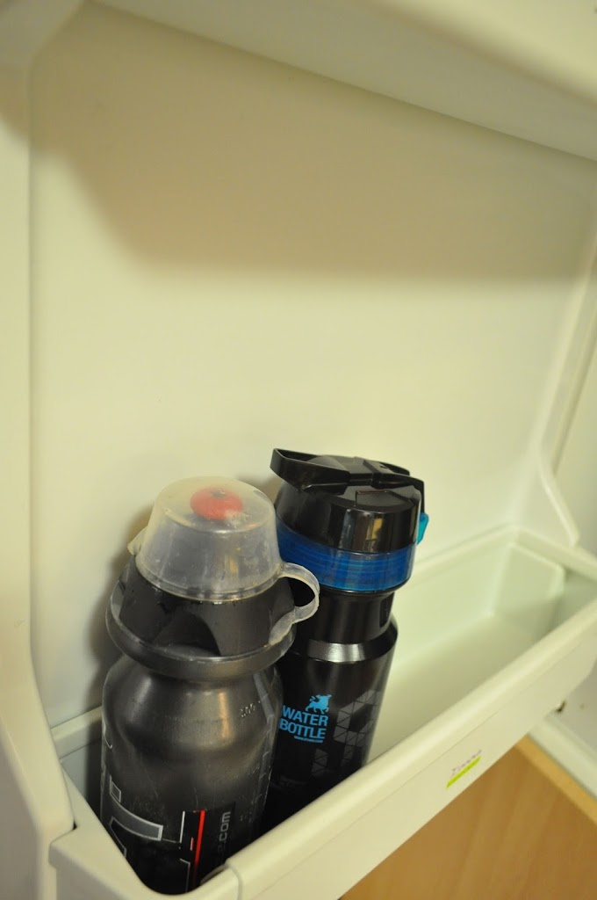

Vou fazer 200 km de bicicleta e quero levar uma bebida isotónica. Procurei no google por "paleo isotonic drink". A partir dos dois primeiros _links_ ([este](http://everydaypaleo.com/natural-homemade-paleo-sports-drink-recipe/) e [este](http://primalgirl.com/2011/02/28/free-sports-drink-recipe/)) fiz a bebida que descrevo em baixo.

  

**O que levou?**

- 1 litro de água mineral (usei do Luso)
- 1/4 chávena de limão
- 1/4 colher de chá de sal marinho
- 2 colheres de chá de mel (opcional para quem estiver a seguir o Whole30)

  

**Como fiz**

1. Misturar os ingredientes todos até o sal e o mel estarem bem dissolvidos
2. Colocar nos recipientes de transporte
3. Deixar no frigorifico até à hora de usar

  

  

  

  

  

  

