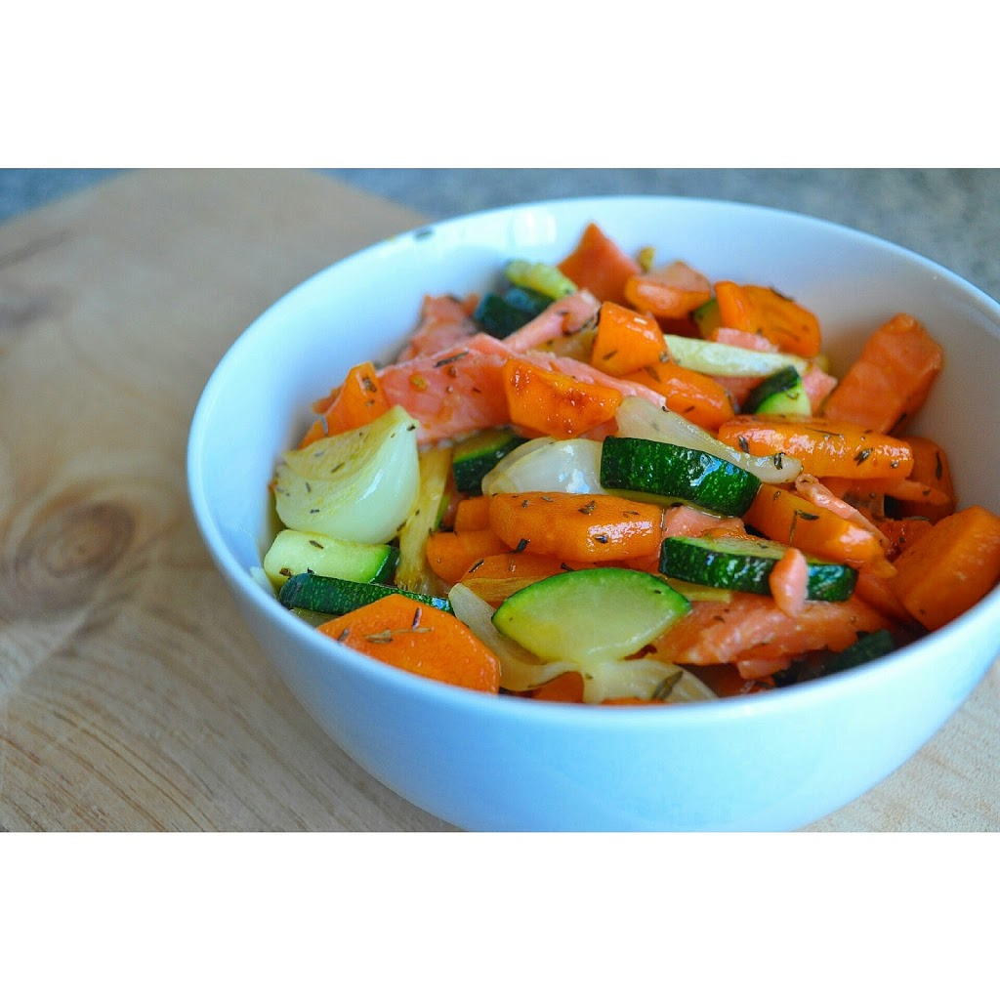

No último Whole30 coleccionei os pequenos-almoços no [Instagram](http://instagram.com/cozinhadecaverna). 

Deixo em baixo a lista completa. Se quiserem alguma receita deixem-me uma mensagem nos comentários.

<table style="border-collapse: separate; border-spacing: 10px;" border="0"><tbody><tr><td>
<a style="margin-left: 1em; margin-right: 1em;" href="https://renatoalvestorres.net/wp-content/uploads/2015/03/IMG_20150201_055306-300x300.jpg"></a>
</td><td style="text-align: center;">1 Lombo de porco assado com beterraba, batata doce e cenoura</td></tr><tr><td>
<a style="margin-left: 1em; margin-right: 1em;" href="https://renatoalvestorres.net/wp-content/uploads/2015/03/IMG_20150203_074322-300x300.jpg"></a>

&nbsp;
</td><td>
2 Ovos estrelados com espinafres salteados com azeite e alho e uma banana
</td></tr><tr><td>

</td><td>
3 Omelete de coentros com maçã
</td></tr><tr><td>

&nbsp;</td><td>
4 Sardinhas salteadas com especiarias, tomate, beterraba e banana
</td></tr><tr><td>

&nbsp;</td><td>
5 Ovos mexidos com espinafres&nbsp;salteados, nabos bebé salteados em banha de porco preto, amêndoas e banana
</td></tr><tr><td>

</td><td>
6 Lombo de porco assado com batata doce, tomate e cajus
</td></tr><tr><td>

&nbsp;</td><td>
7 Ovos mexidos com batata doce salteada em óleo de coco, beterraba aos palitos e avelãs
</td></tr><tr><td>

&nbsp;</td><td>
&nbsp;8 Cavala em azeite biológico, salada mista de alfaces, manga e avelãs
</td></tr><tr><td>

&nbsp;</td><td>
9 Hambúrguer feito em casa com beterraba, maçã e cajus
</td></tr><tr><td>

&nbsp;</td><td>
10 Hambúrguer feito em casa com salada, diospiro e amêndoas
</td></tr><tr><td>

&nbsp;</td><td>
11 Bolinhos de bife de perú, batata doce assada&nbsp;(sobras do jantar), ovo, salsa e malagueta
</td></tr><tr><td>

&nbsp;</td><td>
12 Tortilha de batata, ervilhas e cenoura (sobras do jantar)
</td></tr><tr><td>

&nbsp;</td><td>
13 Sardinhas&nbsp;em molho de tomate acompanhadas de nabo bebé, cenoura e alho francês salteados em banha de porco preto e tomilho
</td></tr><tr><td>

&nbsp;</td><td>
14 Bolinhos de alho francês, gengibre e malagueta com salada de alface e amêndoas
</td></tr><tr><td>

&nbsp;</td><td>
15 Cenouras, courgette e cebolinhas salteadas em banha de porco preto e tomilho com truta fumada
</td></tr><tr><td>

&nbsp;</td><td>
16 Ovos estrelados em óleo de coco com salada de rúcula, amêndoas e banana
</td></tr><tr><td>

&nbsp;</td><td>
17 Lombo de porco assado, batata doce, laranja e salada de rúcula
</td></tr><tr><td>

&nbsp;</td><td>
18 Ovos estrelados em cima de batata doce salteada em óleo de coco com gengibre em pó, curcuma, sal e tomilho
</td></tr><tr><td>

&nbsp;</td><td>
19 Vegetais salteados em banha de porco preto com lombo de porco assado cortado em pedaços e cajus
</td></tr><tr><td>

&nbsp;</td><td>
20 Ovos mexidos com ananás e avelãs
</td></tr><tr><td>

&nbsp;</td><td>
21 Ovas de pescada salteadas em óleo de coco, temperadas com azeite, vinagre, salsa e alhos, acompanhada de ananás e framboesas
</td></tr><tr><td>

&nbsp;</td><td>
22 Tortilha de alho francês e malaguetas com framboesas, lascas de coco e cajus
</td></tr><tr><td>

&nbsp;</td><td>
23 Coelho estufado com batata cozida e salada de alface (sobras do jantar)
</td></tr><tr><td>

&nbsp;</td><td>
24 "Arroz" de&nbsp;couve-flor&nbsp;com ovo, cenoura e ervilhas
</td></tr><tr><td>

&nbsp;</td><td>
25 Rolos de ovo e tomilho com&nbsp;manteiga de amêndoa e tomate
</td></tr><tr><td>

&nbsp;</td><td>
26 Cavala em azeite picante com cenoura ralada, framboesas e manteiga de amêndoa
</td></tr><tr><td>

&nbsp;</td><td>
27 Mini hambúrgueres feitos em casa com courgette e nabo salteados, acompanhados por laranja
</td></tr><tr><td>

&nbsp;</td><td>
28 Mistura de cavala com coentros, cajus e sementes de&nbsp;sésamo&nbsp;(temperados com azeite e vinagre), acompanhada por laranja
</td></tr><tr><td>

&nbsp;</td><td>
29 Hambúrguer feito em casa sobre cama de cajus, com salada de alface, cenoura e coentros
</td></tr><tr><td>

&nbsp;</td><td>
30 Ovos mexidos com sementes de abóbora e laranja
</td></tr></tbody></table>
