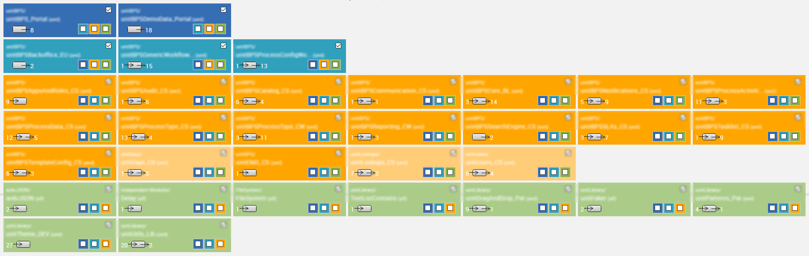
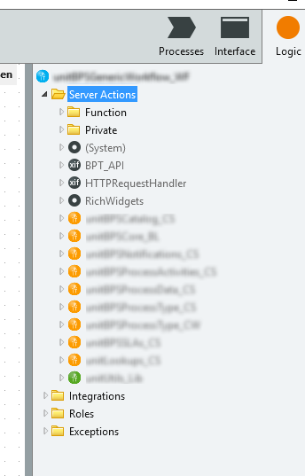
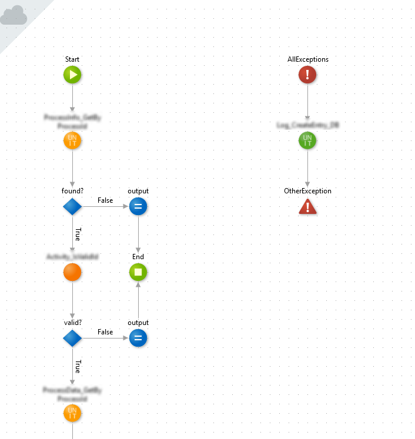
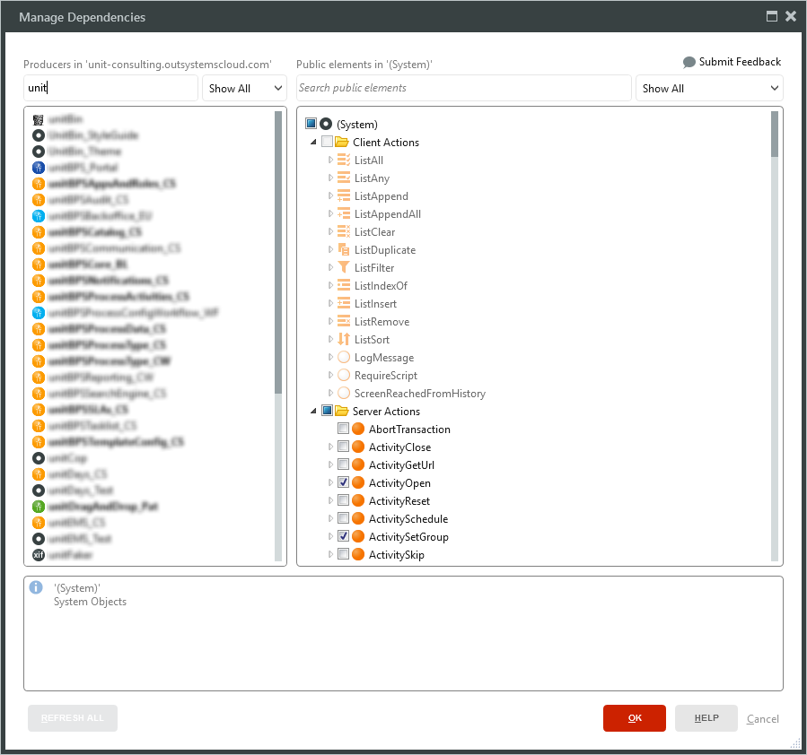

_Reading time: \[rt\_reading\_time\] minutes._

> Mere color, unspoiled by meaning, and unallied with definite form, can speak to the soul in a thousand different ways. --Oscar Wilde

After 600 hours of [OutSystems online training](https://www.outsystems.com/learn/courses) and the [Associate Developer Certification](https://www.outsystems.com/profile/5151/renato-torres/), it was time to do some real work.

My first OutSystems project consisted of a 300 Application Objects solution around [Business Processes](https://www.outsystems.com/learn/courses/17/master-class-on-modeling-business-processes-bpt), with relatively different challenges:

- Plain Old CRUDs
- Several types of users, with different sets of functionalities
- Integration with [Elasticsearch](https://www.elastic.co/webinars/getting-started-elasticsearch) and other cloud available services
- BPTs for business and technical needs
- Jobs / Timers
- .Net extensions
- Dashboards & reporting
- Specific UI/UX
- Dummy data generation
- Automated testing
- And so on...

After several interactions / sprints, it was time for some refactoring, following the precious advises from the Module Naming Conventions and [Architecting Sustainable Applications](https://www.outsystems.com/learn/paths/8/architecting-sustainable-applications/) courses, with the help of the [Discovery Tool](https://www.outsystems.com/forge/component/409/Discovery/) and supported by the three golden validation rules:

1. No upward references
2. No references among orchestrations or end-users
3. No cycles

With a couple of days of [deep work](https://renatoalvestorres.net/o-trabalho-profundo/), [we](http://unit-consulting.ae/) reached an architecture with all the concepts well organized, modules easy to reuse, capable of having independent Business Owners per application and no breaches regarding the above rules:

\[caption id="attachment\_1648" align="aligncenter" width="1866"\] Discovery tool canvas with all our modules\[/caption\]

During the process [we](http://unit-consulting.ae/) felt the need to have some Studio support so we could easily identify at any moment the kind of module we're dealing with. It's something not new - [we](http://unit-consulting.ae/) found several ideas on the OutSystems community regarding this need:

- [https://www.outsystems.com/ideas/2459/tint-service-studio-tab-interface-based-on-architecture-canvas-layer-standard-col](https://www.outsystems.com/ideas/2459/tint-service-studio-tab-interface-based-on-architecture-canvas-layer-standard-col)
- [https://www.outsystems.com/ideas/1559/prevent-architecture-pitfalls-directly-from-servicestudio](https://www.outsystems.com/ideas/1559/prevent-architecture-pitfalls-directly-from-servicestudio)
- [https://www.outsystems.com/ideas/1455/dynamic-high-level-architectural-design-diagrams-at-application-selection](https://www.outsystems.com/ideas/1455/dynamic-high-level-architectural-design-diagrams-at-application-selection)

With no alternatives besides the naming conventions, [we](http://unit-consulting.ae/) tried something very simple but efective - module icons with the color of the corresponding architectural layer.

\[caption id="attachment\_1664" align="alignnone" width="219"\] Dark blue - orchestration  
Light blue - end user  
Orange - core services  
Green - libraries\[/caption\]

The result from the Studio perspective was:

\[caption id="attachment\_1646" align="alignnone" width="344"\] In the explorer side pane is possible to see the type of module we're dealing with and all the dependencies.\[/caption\]

\[caption id="attachment\_1644" align="alignnone" width="706"\] When modeling the flows, is possible to see the type of actions we're using.\[/caption\]

\[caption id="attachment\_1645" align="alignnone" width="899"\] When adding or changing dependencies, is possible again to see the kind of modules we including.\[/caption\]

From our perspective the gives us two good advantages:

1. You see the architectural layers in the most used screens of the OutSystems Studio
2. Makes it easier to identify the type of module were dealing and if we're using or including functionalities from the correct layer

Some might argument that you shouldn't do any development without having those worries in mind and is not the colors of the icons that will make a huge difference.

Nevertheless, teams are made of humans. Teams have different levels of experience and expertise. Teams have pressure and tight deadlines. Teams have elements that sometimes don't sleep at night because of a sick child. So all the help to remind us of the important things is always welcome. That's why we're going to keep using these colored module icons.

What do you think?

 

_PS: I really recommend the [Architecting Sustainable Applications](https://www.outsystems.com/learn/paths/8/architecting-sustainable-applications/) courses. It made a huge difference in the way I see the OutSystems platform and how solutions should be built. It made me enjoy (even more) this technology!_

* * *

Photo by [Alex Holyoake on Unsplash](https://unsplash.com/@stairhopper)
