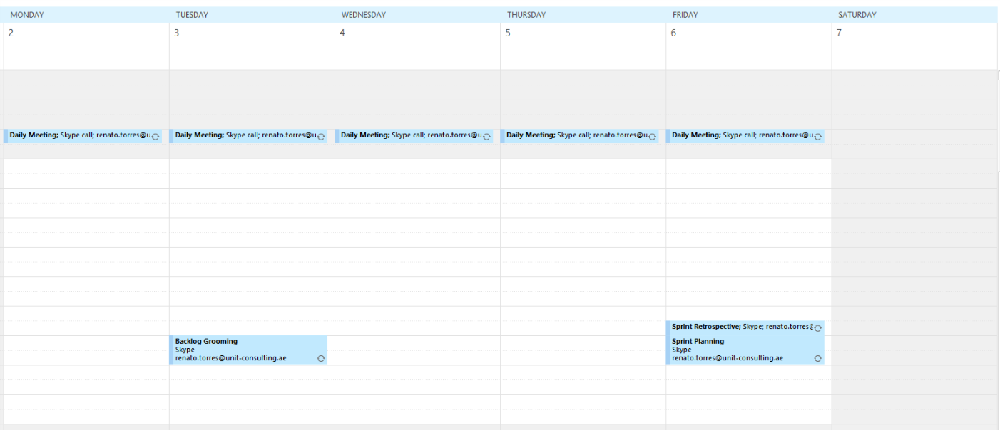
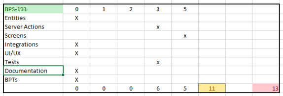
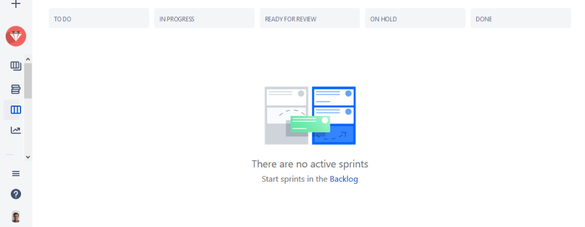

_Reading time: \[rt\_reading\_time\] minutes._

> “Embrace the unknown! That’s where learning lies! If you’re too afraid to learn, you will never get any better. This is the key to being successful at Scrum: embrace change.” ― [Jeff Sutherland](https://www.goodreads.com/author/show/2290725.Jeff_Sutherland), [The Power of Scrum](https://www.goodreads.com/work/quotes/18254398)

Its been 23 years since the presentation of the Scrum framework by Jeff Sutherland and Ken Schwaber at the OOPSLA '95, and almost 20 years since the creation of the [Agile Manifesto](http://agilemanifesto.org/). In those two decades, according to a 2017 Scrum Alliance report, Scrum became the most used agile methodology, with more than 45% of usage time in North America, Europe, Australia and Asia.

My experience with Scrum started in 2010, with a project team of four Java programmers and two BPMS/BRMS developers. At the end of 2016, our initial group was a lot bigger, around eight Scrum teams, supporting critical systems and developing new projects, with a complex organizational context, dependencies of "waterfall teams", and corporate procedures.

Today I have a completely different challenge.

My team:

1. Is distributed in three cities/countries: Lisbon (Portugal), Rotterdam (Netherlands) and Kuwait City (Kuwait);
2. Is multidisciplinary, with a Team Leader, Developers, and a UI/UX expert;
3. Has different degrees of knowledge and experience of OutSystems, from Experts to just certified Associates;
4. Has different experiences of Scrum usage (some had no experience at all).

This is the story of our first two months and I'll:

1. Give a brief introduction to Scrum;
2. Explain how we apply the Scrum roles, artifacts and events;
3. Detail the tools that support us.

* * *

# Scrum in 60 Seconds

For newcomers to Scrum, I always recommend to read the [Scrum Primer](http://scrumprimer.org/) but to give context to the rest of the article, I'll do a "quick-and-dirty" introduction.

As described in the Primer:

> _Scrum packages_ proven _product-development concepts in a simple framework,_ including: _real teams, cross-functional teams, self-managing teams,_ _short iterative full-cycle feedback loops, and lowering the cost of change. These concepts increase agility and feedback, enable earlier ROI, and reduce risk._

From a "static perspective", Scrum contains Roles, Artifacts, and Events:

- **Roles** - Product Owner, Scrum Master, and the Team
- **Artifacts** - Product Backlog, Sprint Backlog, Sprint Board, and the Sprint Burndown Chart
- **Events** - Sprint Planning, Daily Scrum, Sprint Review, Retrospective, and the Backlog Refinement (or Grooming)

\[caption id="" align="aligncenter" width="832"\] Scrum Dynamic Model\[/caption\]

From a dynamic perspective:

1. All Scrum rules are enforced by the **Scrum Master**.
2. It starts with the creation of the **Product Backlog** by the **Product Owner**, which contains a list of customer-centric features or user stories, prioritized by ROI (Return On Investment).
3. The development is done in **Sprints**, which typically lasts from one to four weeks.
4. In the first day of the Sprint, the Product Owner, the Team, and the Scrum Master meet to execute the **Sprint Planning**, a two-part session where the "what" and "how" will be defined for the Sprint.
5. At the end of the Sprint Planning, the Team has prepared the list of work to be done. This list is called **Sprint Backlog** and represents the forecast regarding the goals to be attained.
6. Once the Sprint starts, the Team meets every day for the **Daily Scrum**. This meeting usually is done standup and _"each member reports to the other members of the team: (1) What has been accomplished since the last meeting?; (2) What will be done before the next meeting? and (3) What obstacles are in the way?"_.
7. During the Sprint, the Team uses the **Sprint Board** to represent the status of each work item (to do, in progress, and done) and the **Sprint Burndown Chart** to track the amount of work done versus the forecasted.
8. During the Sprint, the Team and the Product Owner reserve around 10% of the time for **Product Backlog Refinement**, splitting big items into smaller ones, analyze items, re-estimate, and re-prioritize, to facilitate the preparation of future Sprints.
9. At the end of the Sprint, two meetings focused on inspection and adaption take place: the **Sprint Review** (functionality) and the **Retrospective** (process and environment).
10. In the **Sprint Review**, the Team and Product Owner present the result of the Sprint to all the relevant stakeholders, usually in the form of a working demo. All the participants are free to ask questions and give input.
11. In the **Retrospective**, the Team discusses what’s working and what’s not working, and agree on changes to try. The goal is to deal with problems throughout every Sprint and not only at the end of the project.

* * *

# How do we apply Scrum?

Our team is building an OutSystems accelerator to support Business Process Management (BPM), which provides additional advanced capabilities not available out-of-the-box in the #1 low code platform.

We are doing it by running a self-managed team.

Two persons of our team have more than a decade of experience in BPM, so they do the **Product Owner** role, dividing the responsibility to manage the Product Backlog and decide the priorities, based on feedback from partners and customers.

I assume the role of **Scrum Master**, accumulated with other responsibilities.

Our **Team** has a OutSystems Team Leader  and Developers, and UI/UX expert.

We are currently using one week Sprints, and our events are organized the following way:

#### Sprint Planning

Due to the time differences we opted to do the planning of a new sprint in the end of the week. This allow for the team members of Kuwait to start on monday with everything ready.

We explain the stories to all team members, review the estimations and discuss the implementation approach if needed.

#### Daily Scrums

Occurs every day - 7 a.m. in Lisbon, 8 a.m. in Rotterdam and 10 a.m. in Kuwait.

We use video conference tools, with the Scrum Master sharing a screen with the Sprint Board and the Sprint Burndown Chart.

We answer the three "magic" questions I mentioned before. It's not standup but it finishes under 15 minutes.

#### Backlog Refinement / Grooming

Occurs once a week. We gatter the Team Leader, the Product Owners and the UI/UX expert over a video call to split stories, detail functional requirements and prioritize the backlog items.

We always try to balance new functionalities vs. bugs vs. technical debt as one way to avoid our practice to become [frAgile](https://www.outsystems.com/blog/agile-versus-fragile-handle-scrum-care.html).

If stories need to detailed further, we divide them between the Team. This approach increases ownership of the stories and the product, increases the knowledge, and allow developers to learn more about the full intent of the functionality.

#### Retrospective

Occurs once a week, ideally before the Sprint Planning.

Each team member takes one or two items that we've done well and one or two that we should improve. We discuss and choose one or two topics for improvement in the following week.

* * *

Regarding the Artifacts, we use the Product Backlog, the Sprint Backlog, Sprint Board, and the Sprint Burndown Chart.

#### Product Backlog and Sprint Backlog

Our Product Backlog and Sprint Backlogs contain four types of items:

- **Epics** - High level functionalities or requirements that need to be split into menegeable size stories;
- **Stories** - Functionalities that are useful, testable and atomic;
- **Bugs** -  Stuff that needs to be fixed;
- **Task** - Work not related to OutSystems development  like UI/UX, infrastruture or the preparation of presentations.

#### Estimation

We estimate Stories, Bugs and Tasks using Story points and the Fibonachi sequence.

Items with more than 13 story points are considered too big and usually need to be splited.

Each team member estimates all the items for discussion in the Sprint Planning.

To facilitate this process we use a simple spreadsheet with the most important components in OutSystems:

#### Sprint Board and Burndown Chart

Our Sprint Board has five columns:

1. **To Do** - work not started
2. **In Progress** - work being done
3. **Ready for Review** - work already done but needs review (for example, Associate developers work is reviewed more frequently before it is considered done)
4. **On Hold** - items that need to be parked for some reason
5. **Done** - item is developed and tested

# The tools

The list of tools we use to manage our work is:

1. Confluence
2. Draw.io
3. Jira
4. Skype
5. Slack

# Is this the end?

 

 

 

* * *

Photo by [Olga Guryanova](https://unsplash.com/photos/ft7vJxwl2RY) on [Unsplash.](https://unsplash.com)
