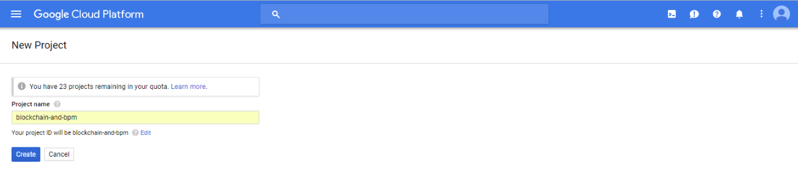

_Reading time: \[rt\_reading\_time\] minutes._

I've been exploring how to combine [Blockchain](https://www.youtube.com/watch?v=SSo_EIwHSd4), [OutSystems](https://outsystems.com) and Business Processes.

Our goal is not focus on Blockchain technology only. We aim to understand what solutions we can build, the impacts in terms of business processes and how can we leverage OutSystems strengths to deliver the benefits faster.

For that, we'll be using [Hyperledger Fabric](https://www.hyperledger.org/projects/fabric) and [Hyperledger Composer](https://www.hyperledger.org/projects/composer).

**Hyperledger Fabric** is a permissioned distributed ledger technology platform, designed for use in enterprise contexts.

As described in the [official documentation](http://hyperledger-fabric.readthedocs.io/en/latest/whatis.html):

> Fabric has a highly modular and configurable architecture, enabling innovation, versatility and optimization for a broad range of industry use cases including banking, finance, insurance, healthcare, human resources, supply chain and even digital music delivery.

Also, it's open source and supported by the [Linux Foundation](https://www.linuxfoundation.org/projects/) and has a strong developer and [vendor support](https://www.hyperledger.org/resources/vendor-directory).

**Hyperledger Composer** aims to simplify developing blockchain solutions making it easier to integrate with the existing business systems.

[Prototypes in several industries made the Hyperledger community realize that building blockchain solutions directly on top of Fabric would generate a lot of boilerplate code](https://youtu.be/fdFUsrsv5iw?t=123) related to error handling, data validation, access control and remote calls, when the focus should be solving business needs.

Composer allows application developers to build solutions using common development tools with business level concepts like assets, participants and transactions.

This is how those two projects fit in the Hyperledger scope:

In the simplest way I could remember:

1. Fabric is the technical framework that will run the blockchain network
2. Composer simplifies the development and exposes REST APIs for integration with existing systems

This first post will **start with the basics**: installation of a development environment for prototyping purposes.

I'll do a step-by-step tutorial so any person can follow it without troubles.

Let's dive in. We will:

1. Setup a Google Cloud account
2. Create an Ubuntu Virtual Machine
3. Install Hyperledger pre-requirements
4. Install Hyperledger Fabric and Hyperledger Composer
5. Deploy a Blockchain Business Network
6. Expose the Business Network using a REST API

I will not explain all the concepts behind Hyperledger Fabric and Hyperledger Composer. For that refer to the [official documentation](https://hyperledger.github.io/composer/latest/index.html).

# 1\. Setup a Google Cloud account

First you need to create a [Google Cloud](https://cloud.google.com/) account and [setup the billing](https://console.cloud.google.com/billing). Currently Google is offering an $300 credit so if you're trying on a personal basis, this will last a few months.

# 2\. Create an Ubuntu Virtual Machine

In the Google Cloud console, click "Create and empty project".

Give the project a name and ID.

In the project dashboard, access the "VM Instances" page.

Click the "Create" VM instance button.

In the instance creation screen you need to:

1. Set the name ("hyperledger-vm" in my case)
2. Change the machine type (small is enough to start)
3. Select Ubuntu as the operation system and set the storage for 30 Gb
4. Check "Allow HTTP traffic"

After a couple of minutes, your instance will be up and running:

The Hyperledger Composer Playground and REST APIs run by default on ports 8080 and 3000 so we need to add them in the firewall rules:

Edit the "default-allow-http" rule.

And add the "tcp:8080; tcp:3000". 

# 3\. Hyperledger pre-requirements installation

My installation of Hyperledger pre-requirements was based on [these instructions](https://medium.com/google-cloud/deploy-fabcar-on-hyperledger-fabric-93c082c31b7a) with small changes.

First, open a SSH terminal to the VM. 

For **docker-ce** execute the following commands (you can copy and paste to the SSH terminal each command using normal CTRL+C / CTRL+V):

sudo apt-get update

sudo apt-get install \\
    linux-image-extra-$(uname -r) \\
    linux-image-extra-virtual

sudo apt-get update

sudo apt-get install \\
    apt-transport-https \\
    ca-certificates \\
    curl \\
    software-properties-common

curl -fsSL [https://download.docker.com/linux/ubuntu/gpg](https://download.docker.com/linux/ubuntu/gpg) | sudo apt-key add -

sudo add-apt-repository \\
   "deb \[arch=amd64\] [https://download.docker.com/linux/ubuntu](https://download.docker.com/linux/ubuntu) \\
   $(lsb\_release -cs) \\
   stable"

sudo apt-get update
sudo apt-get install docker-ce
sudo usermod -a -G docker $USER
sudo systemctl enable docker

After these commands you should be able to execute docker:

docker --version

Next is the installation of **docker compose**.

sudo curl -L [https://github.com/docker/compose/releases/download/1.16.1/docker-compose-\`uname](https://github.com/docker/compose/releases/download/1.16.1/docker-compose-`uname) -s\`-\`uname -m\` -o /usr/local/bin/docker-compose

sudo chmod +x /usr/local/bin/docker-compose

If everything is OK, the following command will execute with success and print the docker-compose version.

docker-compose --version

For **Go** language all you need to do is:

VERSION=1.9.1
OS=linux
ARCH=amd64
sudo curl \\
--location [https://golang.org/dl/go$VERSION.$OS-$ARCH.tar.gz](https://golang.org/dl/go$VERSION.$OS-$ARCH.tar.gz) \\
--output go$VERSION.$OS-$ARCH.tar.gz

sudo tar -C /usr/local -xzf go$VERSION.$OS-$ARCH.tar.gz

export PATH=$PATH:/usr/local/go/bin

If everything is OK, the following command will execute with success and print the Go version.

go version

For the **node.js** installation, I'll use NVM (Node Version Manager), a simple bash script to manage multiple active node.js versions.

To install NVM, run the following commands:

curl -o- https://raw.githubusercontent.com/creationix/nvm/v0.33.11/install.sh | bash

export NVM\_DIR="$HOME/.nvm"
\[ -s "$NVM\_DIR/nvm.sh" \] && \\. "$NVM\_DIR/nvm.sh" # This loads nvm
\[ -s "$NVM\_DIR/bash\_completion" \] && \\. "$NVM\_DIR/bash\_completion" # This loads nvm bash\_completion

For node.js (version 8.X) just run:

nvm install 8

If everything is OK the following should return "v8.11.1" (example).

node --version

To finish with the pre-requirements we need to downgrade Python, install the build tools and the unzip utility:

sudo apt-get install python

sudo apt-get install build-essential

sudo apt-get install unzip

# 4\. Hyperledger Fabric and Composer installation

The Hyperleder Fabric and Composer installations are straightforward and the [instructions from the documentation](https://hyperledger.github.io/composer/latest/installing/development-tools.html) work without problems.

For the Fabric the commands are:

mkdir ~/fabric-dev-servers && cd ~/fabric-dev-servers

curl -O https://raw.githubusercontent.com/hyperledger/composer-tools/master/packages/fabric-dev-servers/fabric-dev-servers.tar.gz
tar -xvf fabric-dev-servers.tar.gz

cd ~/fabric-dev-servers
./downloadFabric.sh

For the Composer the commands are:

npm install -g composer-cli

npm install -g composer-rest-server

npm install -g generator-hyperledger-composer

npm install -g yo

npm install -g composer-playground

To start Fabric:

cd ~/fabric-dev-servers
./startFabric.sh
./createPeerAdminCard.sh

To stop Fabric:

~/fabric-dev-servers/stopFabric.sh

To start Composer Playground:

composer-playground

After this you should be able to access it using the VM IP external address on port 8080:

You can find your external IP address here:

# 5\. Deploy a Blockchain Business Network

For building a blockchain network you have two options:

1. Develop one from scratch
2. Use one of the samples that Hyperledger Composer can produce

To have something quickly to do some testing, I'll explain only the second one.

The Composer Playground can connect to blockchain networks running on a Hyperledger Fabric or simulate a network directly in the browser.

This second option comes with a predefined templates that one can use to:

1. Export to the file system
2. Import to the Fabric
3. Generate REST APIs

For the export/import follow the next steps.

First, create a new business network on the Web Browser connection:

Pick one of the starter templates and click "Deploy". 

Once the network is created, connect to it and use the export option as indicated in the images below. This produces a BNA (Business Network Archive) which is essentially a zip file with all the network elements definition.

 

The next step is to transfer this file to our Hyperledger VM. Check [this link](https://cloud.google.com/compute/docs/instances/transfer-files) on how to do it. Basically you need to install the Google Cloud command line tools and execute the following commands.

The first one initializes the gcloud with the project settings:

gcloud init

The second one will make the copy using SCP (replace PATH\_TO\_FILE and GCLOUD\_USER with the correct values for you):

gcloud compute scp PATH\_TO\_FILE\\animaltracking-network.bna GCLOUD\_USER@hyperledger-vm:animaltracking-network.bna

Back to the SSH shell you should be able to see something similar to the following:

To install the network execute the following commands:

cp animaltracking-network.bna fabric-dev-servers
cd fabric-dev-servers

composer network install --archiveFile animaltracking-network.bna --card PeerAdmin@hlfv1

 composer network start --networkName animaltracking-network --networkVersion 0.2.4-deploy.0 --card PeerAdmin@hlfv1 --networkAdmin admin --networkAdminEnrollSecret adminpw

The result should be similar to:

Next, import the generated business card:

composer card import --file admin@animaltracking-network.card

# 6\. Generating a REST API

To expose a REST API we need the exploded BNA:

mkdir animaltracking-network
mv animaltracking-network.bna animaltracking-network/animaltracking-network.bna.zip
cd animaltracking-network
unzip animaltracking-network.bna.zip

The result will be similar to:

Archive: animaltracking-network.bna.zip
 extracting: package.json 
 extracting: README.md 
 extracting: permissions.acl 
 creating: models/
 extracting: models/com.hyperledger.composer.animaltracking.cto 
 creating: lib/
 extracting: lib/model.cto.js

To start the REST server execute the following command:

composer-rest-server -c admin@animaltracking-network -n never -w true

You'll be able to browse the API accessing the VM IP external address on port 3000:

#  Conclusion

After this long instructions we have a network deployed and exposed using a REST API.

The next steps will be to connect this network to Business Processes running in OutSystems.

* * *

Photo by [Ilze Lucero](https://unsplash.com/photos/l_VVd8nV3PE?utm_source=unsplash&utm_medium=referral&utm_content=creditCopyText) on [Unsplash](https://unsplash.com/?utm_source=unsplash&utm_medium=referral&utm_content=creditCopyText)
