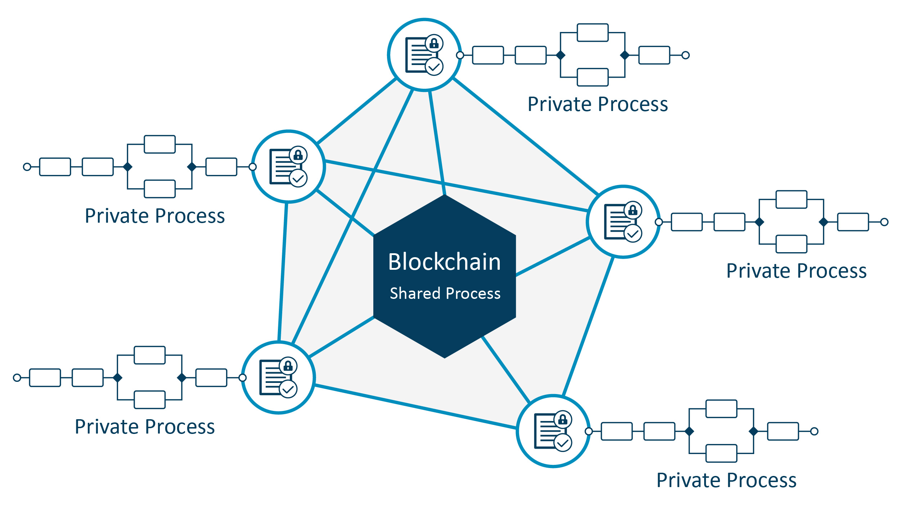
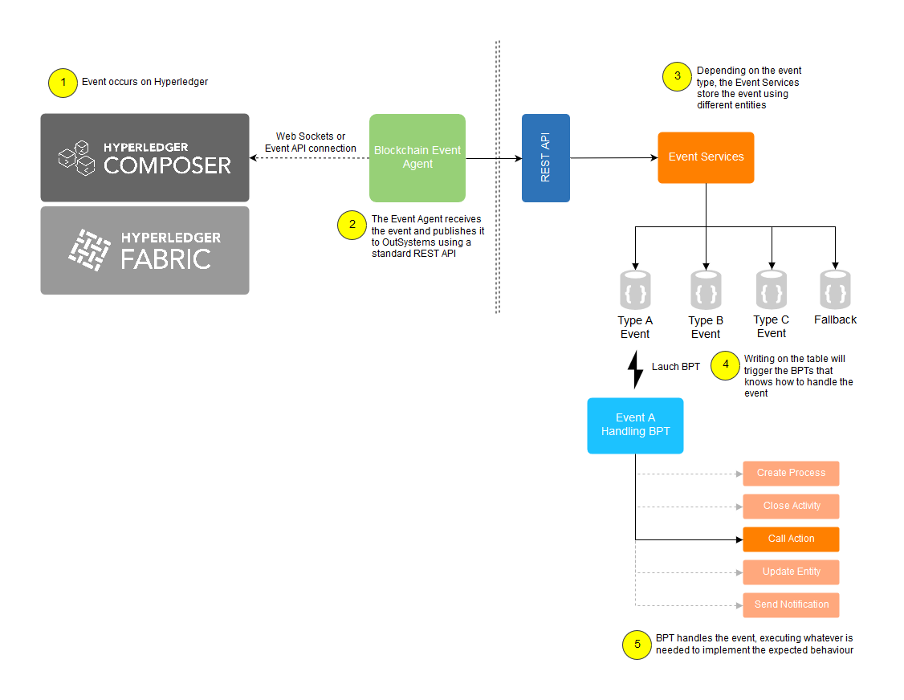

_Reading time: \[rt\_reading\_time\] minutes._

After having Hyperledger Fabric and Hyperledger Composer [up and running](https://renatoalvestorres.net/blockchain-outsystems-and-business-processes-part-1-installing-hyperledger/), we're interested in the integration with OutSystems, more specifically with [Business Processes running in OutSystems](https://success.outsystems.com/Documentation/10/Developing_an_Application/Use_Processes).

Blockchain is going to be critical for the processes in the future, not only because it can bring big gains in efficiency with the simplification of the business networks (removing mans in the middle, for example). It will create the ability to track each step of common processes used by the ecosystem, so that parties can understand and track how data flows.

While blockchain will act as the backbone of a **shared process**, the participants still have their own private processes in the end.

Those private processes can interact with the business network for multiple reasons:

1. Execute blockchain transactions using automatic activities
2. Update blockchain assets or participants on activity or process completion
3. Replicate data from the blockchain for offline usage
4. Update process data on blockchain network event
5. Create a process instance on blockchain network event
6. Complete an activity or process on blockchain network event

With Hyperledger Composer exposing the REST API for [assets, participants and transactions](https://hyperledger.github.io/composer/latest/reference/cto_language.html), points 1 to 3 can be easily handled (check [this article](https://www.outsystems.com/blog/posts/building-blockchain-enabled-app/) on using this API).

The event handling brings some additional complexity with its asynchronous behavior. Hyperledger Composer supports business network events [publishing](https://hyperledger.github.io/composer/latest/business-network/publishing-events.html) and [subscribing](https://hyperledger.github.io/composer/latest/applications/subscribing-to-events) using the NodeJS API or web sockets.

So we'll need to:

1. Subscribe to the events and route them for processing with OutSystems
2. Execute the correct processing logic inside OutSystems

For our prototype we will be using a NodeJS standalone application that subscribes to events using web sockets. On a message received, it calls an OutSystems REST API for event handling.

We named this component **Blockchain Event Agent**.

A code sample to achieve this is:

\[cc lang="javascript"\] const WebSocket = require('ws'); const ws = new WebSocket('ws://35.229.89.113:3000');

ws.on('message', function incoming(data) { console.log(data); // Call OutSystems REST API HERE }) \[/cc\]

 

The solution to process the events received by the OutSystems REST API must:

1. Support different logic per event, with the [Single Responsibility Principle](https://en.wikipedia.org/wiki/Single_responsibility_principle) in mind
2. Execute independent actions per event (if the same event impacts different processes, for example)
3. Handle a large number of events

We've based our implementation in the [Light Processes](https://success.outsystems.com/Documentation/10/Developing_an_Application/Use_Processes/Design_Scalable_Database_Queueing_Using_Light_Processes) feature of OutSystems, designed to support the execution of thousands of technical processes simultaneously.

In a nutshell:

1. The REST API calls a service layer that will write each type of event in a separate database table
2. For each event handling requirement, develop a lightweight BPT that is triggered when an entity entry creation occurs
3. The lightweight BPT executes the specific action for the event processing (create a process, close an activity, update an entity, etc.)

This component is the **Blockchain Event Bridge**.

The following image shows the end-to-end architecture:

With this, our next step will be to setup a production like infrastructure to tune up security, fail-over, and redundancy so we can have a ready to deploy solution.

Stay tuned!

* * *

Cover photo by [Tony Webster](https://unsplash.com/photos/F9o7u-CnDJk?utm_source=unsplash&utm_medium=referral&utm_content=creditCopyText) on [Unsplash](https://unsplash.com/?utm_source=unsplash&utm_medium=referral&utm_content=creditCopyText).
