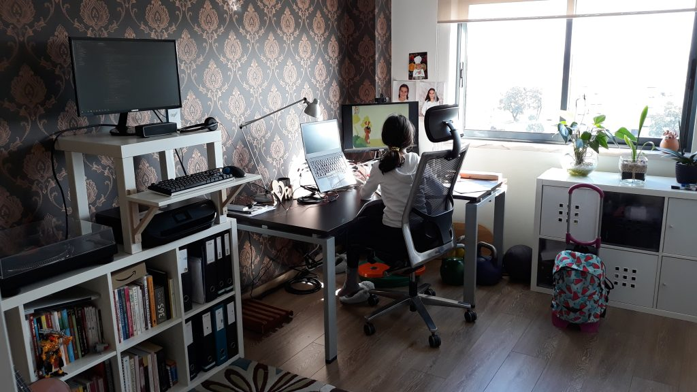
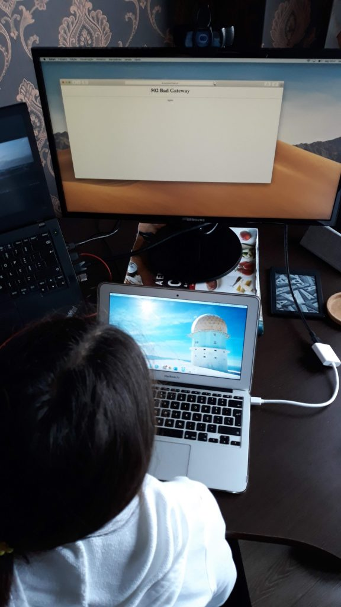
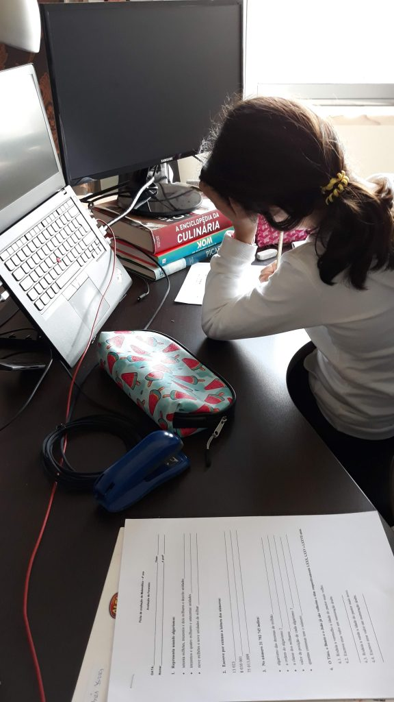
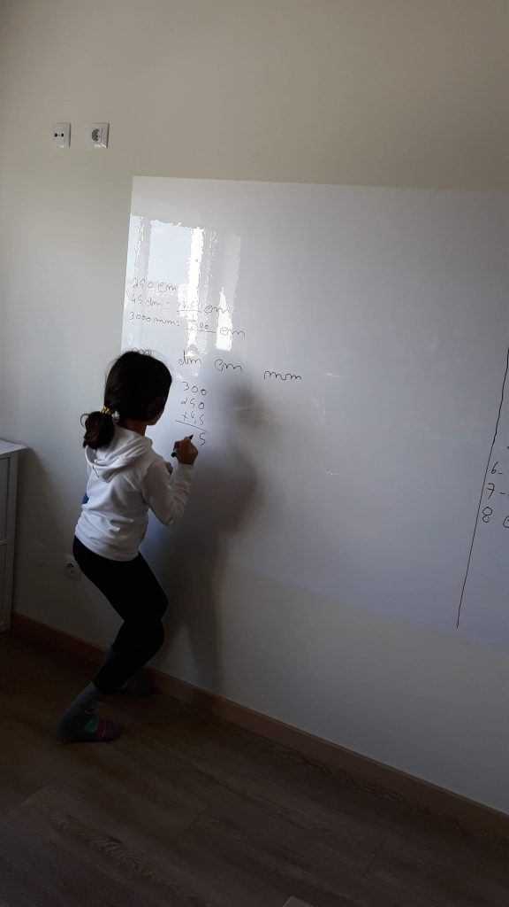
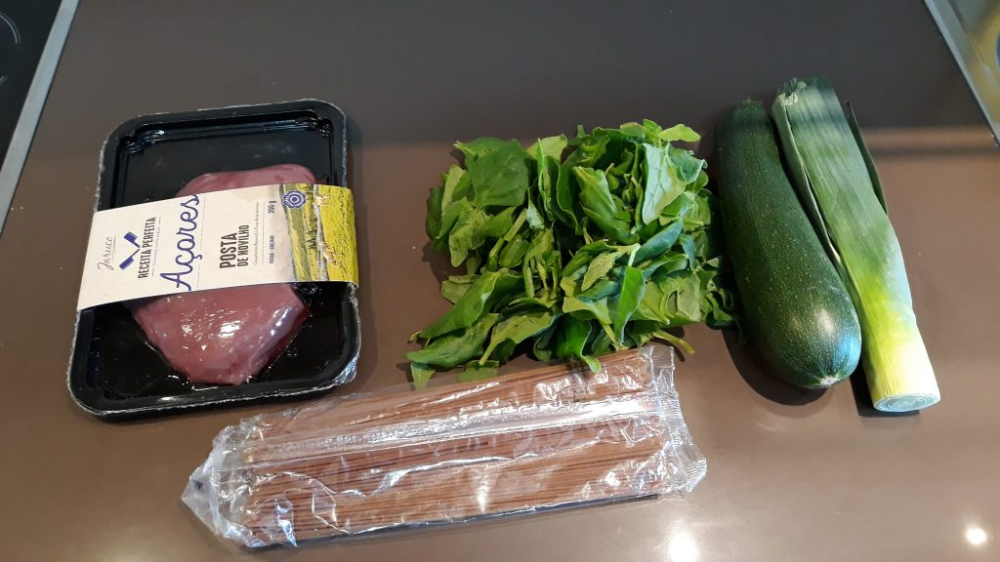
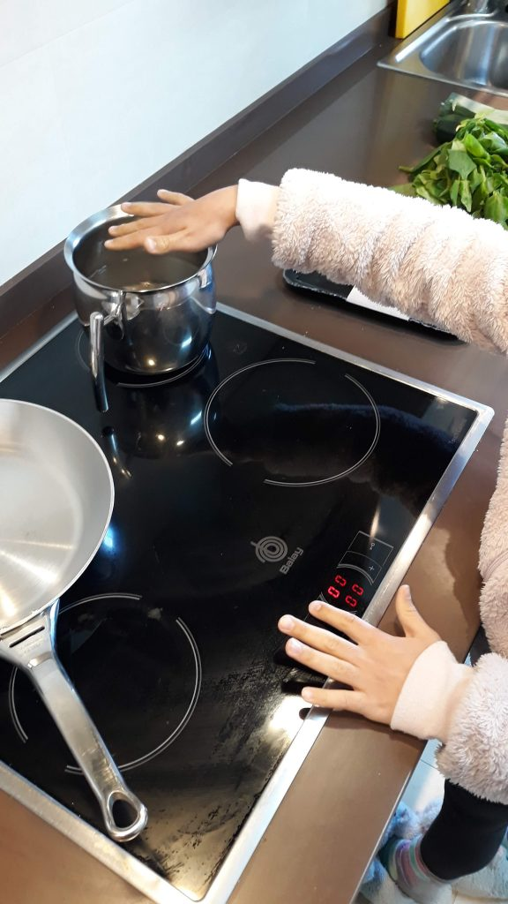
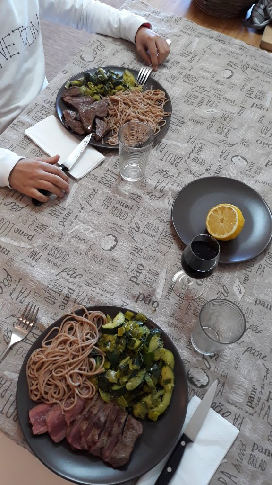
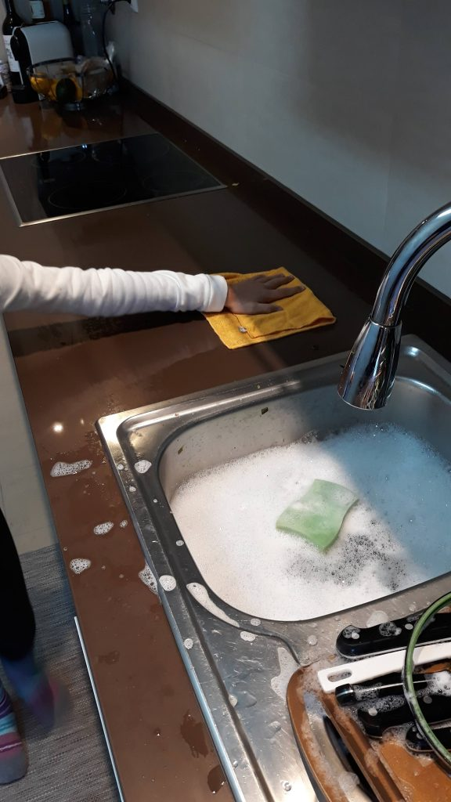
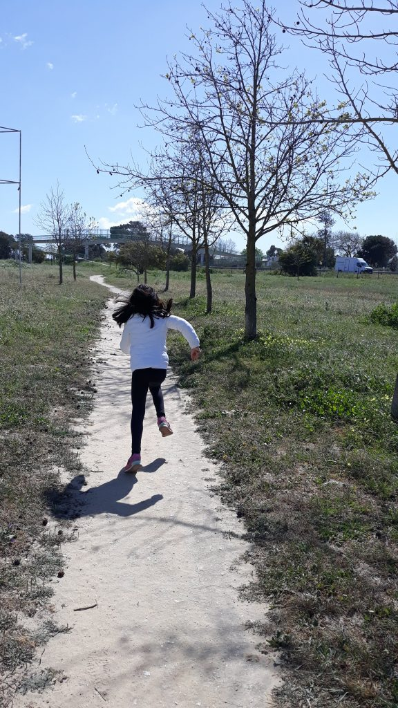
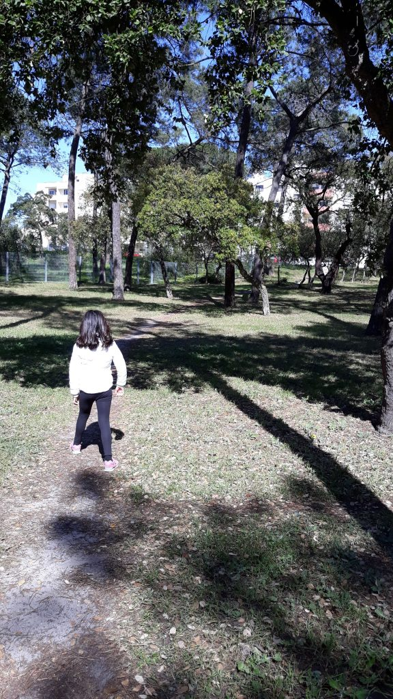

Primeiro dia, começou dentro dos horários normais, neste caso com uma parceira de escritório. Eu fiquei na _standup-desk_, a minha filha na secretária.

Ter companhia foi bastante bom mas no inicio do dia for necessário alinhar algumas regras para garantir que ambos nos poderíamos concentrar nas tarefas em mãos.

Ainda a manhã não tinha começado e já tínhamos o primeiro contratempo: a [Escola Virtual](https://www.escolavirtual.pt/) em baixo, certamente pelo excesso de utilizadores devido a esta situação pouco normal.

Recorremos a [este site](https://www.ensinobasico.com/1o-ciclo/matematica-4o-ano) para obter fichas e ultrapassar este imprevisto. Rendeu umas duas boas horas de estudo!

Chegando a hora de almoço, aprendizagem culinária! O menu foi simples e rápido de preparar: posta de novilho dos Açores com vegetais e esparguete.

Os ingredientes para duas pessoas são:

- Posta de novilhos dos Açores (350g)
- Molho de espinafres
- Uma curgete
- Meio alho francês
- Esparguete integral de espelta
- Azeite q.b.
- Pimenta, sal, alho em pó e curcuma q.b. para temperar

Os passos de preparação são:

1. Colocar duas frigideiras a aquecer, ambas com um fio de azeite
2. Colocar uma pequena panela com água e sal a aquecer na potência máxima
3. Entretanto lavar e cortar os vegetais
4. Na frigideira dos legumes colocar o alho em pó, adicionar os vegetais e os restantes temperos, tapar para ajudar a reduzir os vegetais mais depressa
5. Quando a água estiver a ferver adicionar a massa e um fio de azeite
6. Temperar a carne com sal e pimenta e colocar a cozinhar quando a frigideira estiver bem quente
7. Quando os vegetais começarem a libertar água, destapar para que a mesma evapore e os vegetais não fiquem empapados

Pedi à minha filha que realizasse a seguintes tarefas:

- Colocar as frigideiras e a água a aquecer
- Lavar os vegetais
- Retirar as sementes à curgete
- Cortar a curgete
- Temperar a carne
- Mexer os vegetais
- Colocar a massa a cozer
- Preparar a mesa
- Ajudar a arrumar e limpar

Depois fomos andar 10 minutos para ganhar força para a tarde (sem interação social claro!).

A tarde foi de mais estudo e preparação do computador para o primeiro dia de aulas em tele-conferência, via Zoom.

Até amanhã!
