O dia começou com uma ida à compras para abastecer. A mercearia Jerónimo abre às 8h. Confirmei que não havia ninguém à porta (vê-se a entrada da minha casa) e lá fui.

"Pai, não te demores".

"Não filha. Preparo-te o pequeno-almoço, vês uns desenho animados ao mesmo tempo, antes de terminares de comer eu já estou de volta".

Cheguei à porta e havia um sinal: "Máximo 3 pessoas". Ainda esperei uns 10 minutos para entrar.

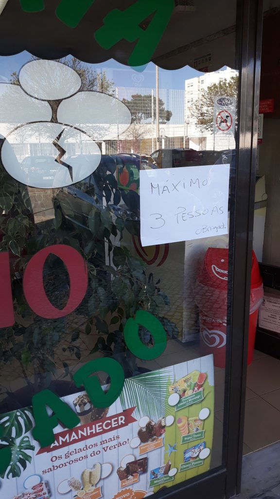

A dona da mercearia estava exausta.

"Sr. Renato, tem sido uma semana que nem imagina. Não aguento isto."

Peixe congelado, atum, fruta, charcutaria, abacates, vegetais, vinho e papel higiénico (claro...). Feito!

"Pai, demoraste tanto tempo, estive quase para te enviar um e-mail".

Para a minha filha hoje foi o primeiro dia de tele-conferência com a professora e com os colegas para preparar o dia de estudo. O esforço da professora é de louvar, conseguir gerir 20+ crianças através do Zoom não é trabalho fácil.

Mas o dia correu bem, com uns [Pomodoros](https://en.wikipedia.org/wiki/Pomodoro_Technique) à mistura, o objetivo foi cumprido.

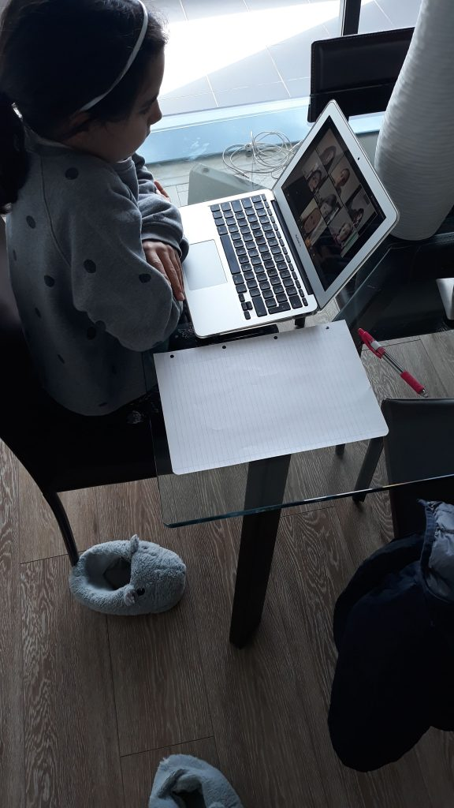

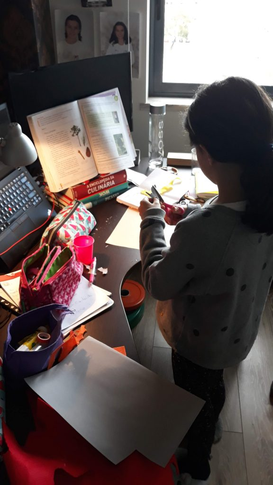

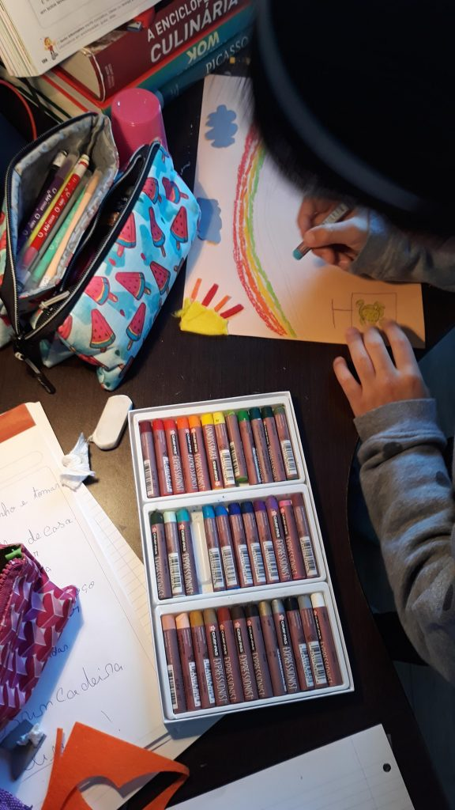

Para o almoço, um favorito meu e da minha filha, que só fazemos quando a Vânia não está: **arroz de bacalhau com espinafres**.

Os ingredientes para duas pessoas são:

- Uma posta de bacalhau grande ou duas pequenas
- Meio pimento
- Uma cebola
- Três dentes de alho
- Um copo de arroz
- Um molho de espinafres
- Azeite q.b.
- Sal, pimenta q.b.
- Folha de louro

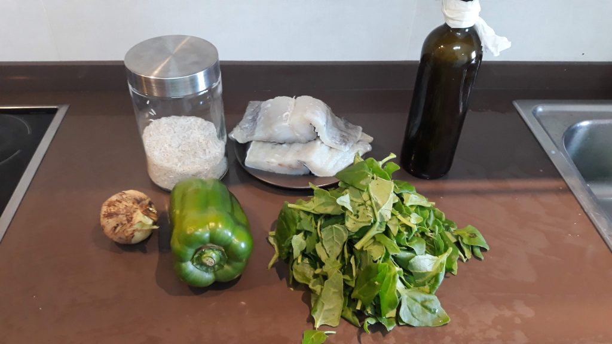

Os passos de preparação são:

1. Cozinhar o bacalhau
2. Em paralelo, picar a cebola, cortar o pimento aos cubos e lavar os espinafres
3. Quando o bacalhau estiver cozido reservar e guardar a água onde onde o mesmo esteve a cozer
4. Na mesma panela (para aproveitar os sabores) fazer um refogado com azeite, cebola e alho
5. Adicionar 4 copos de água da cozedura do bacalhau
6. Quando estiver a ferver adicionar o arroz
7. Enquanto o arroz coze, arranjar o bacalhau em lascas
8. A meio da cozedura do arroz adicionar os espinafres
9. Quando o arroz estiver cozido adicionar o bacalhau e o pimento
10. Se entretanto o arroz ficar muito seco, adicionar um pouco mais de água da cozedura do bacalhau

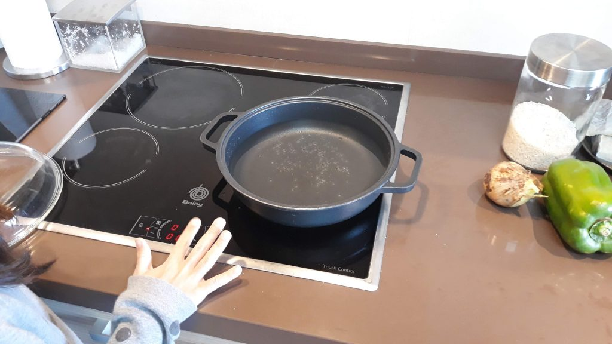

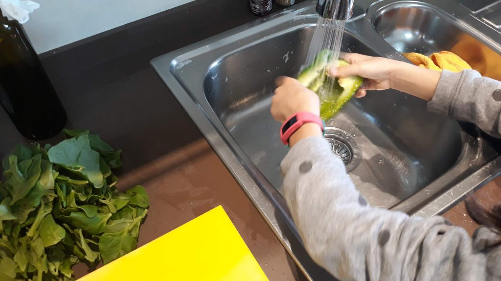

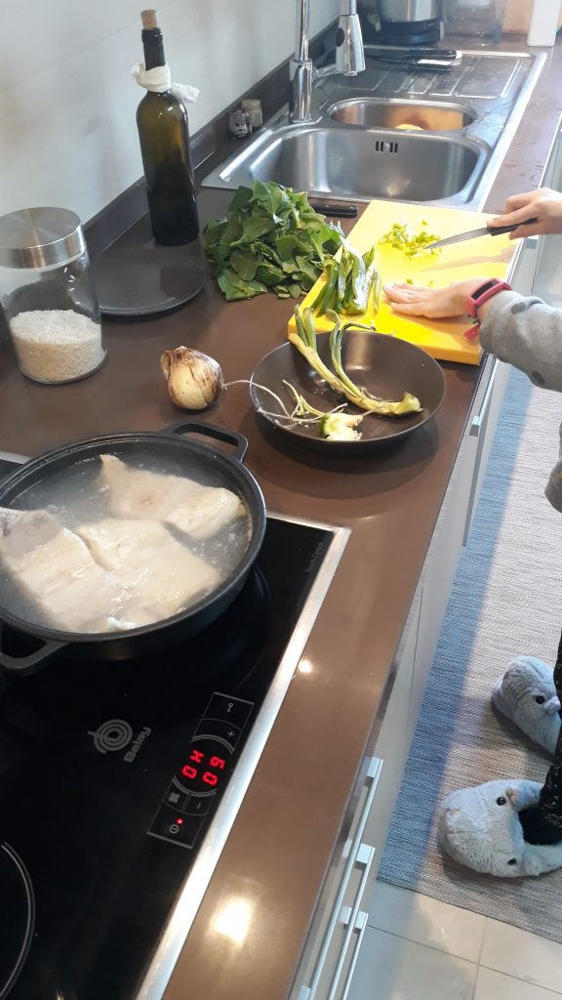

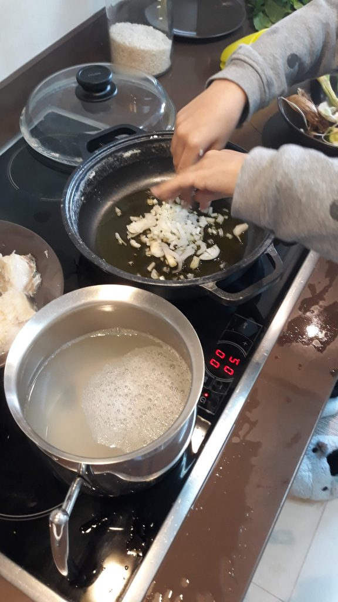

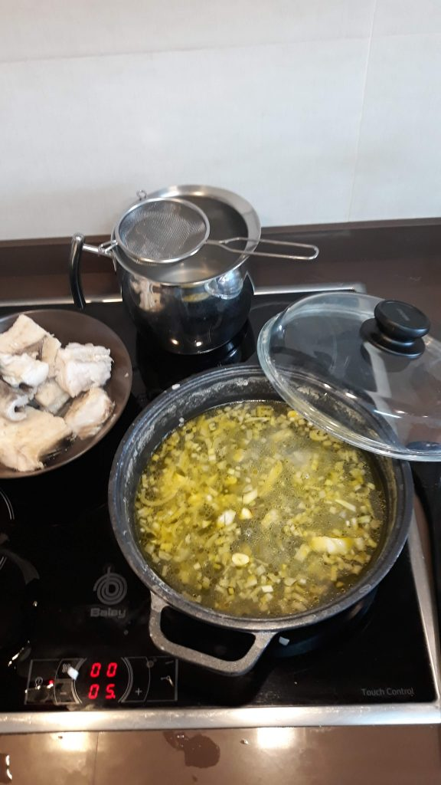

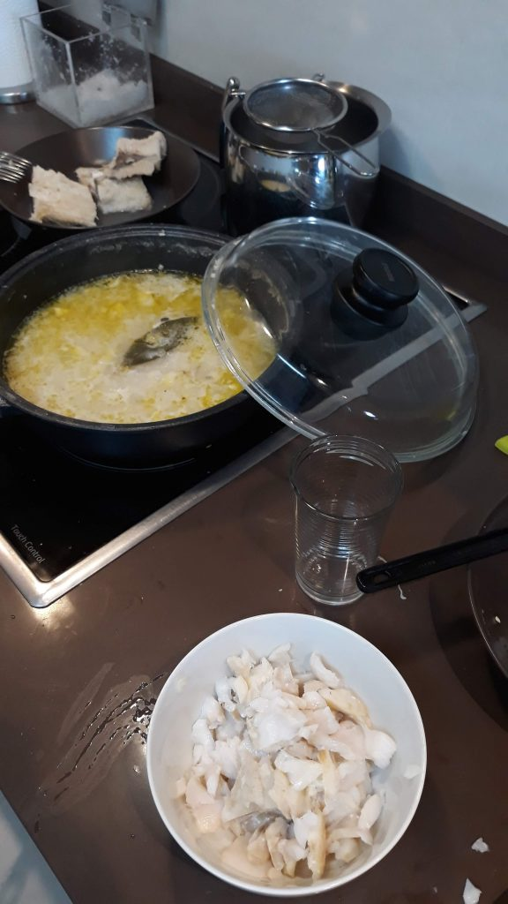

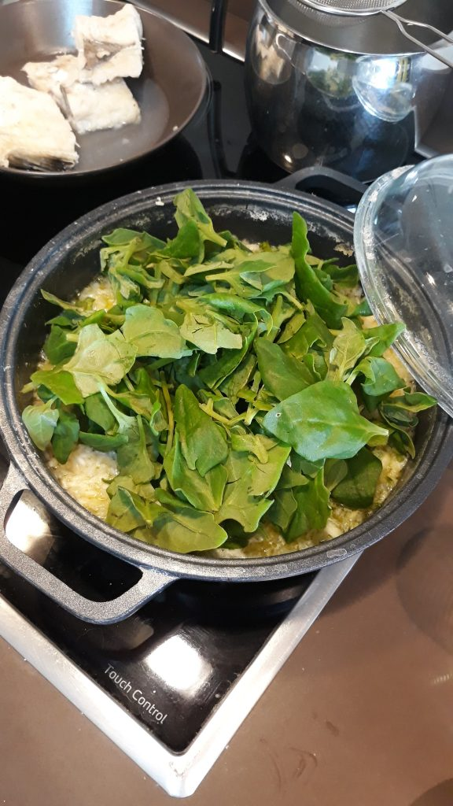

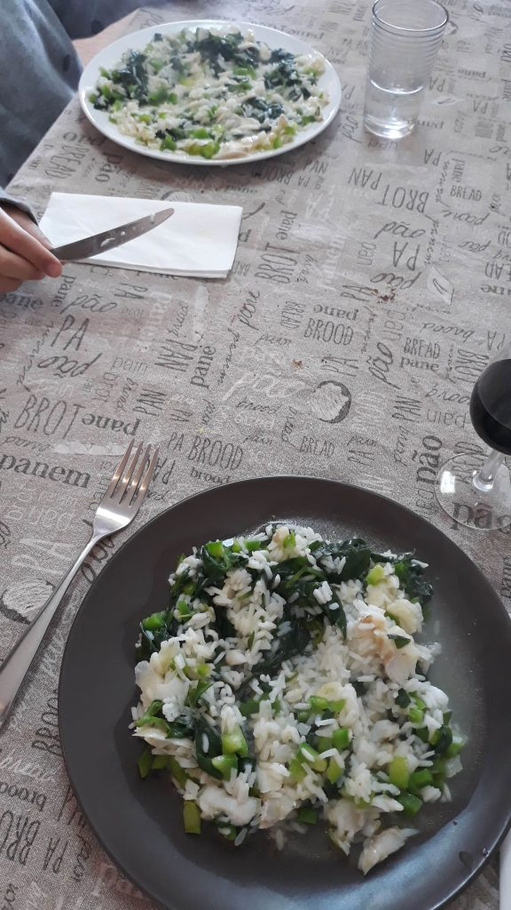

A minha filha realizou as seguintes tarefas:

- Lavar os vegetais
- Cortar os pimentos
- Colocar ingredientes no tacho
- Arrumar e limpar

Estava ótimo. Quase tão bom como o da minha mãe.

Terminei o dia com uma corrida rápida.

Até amanhã! #vamostodosficarbem :-)

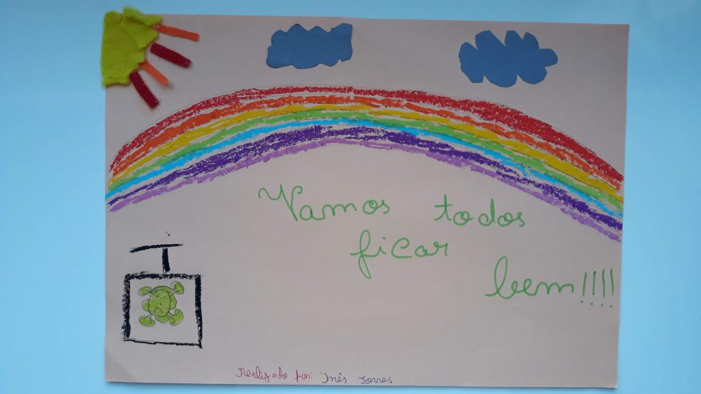
