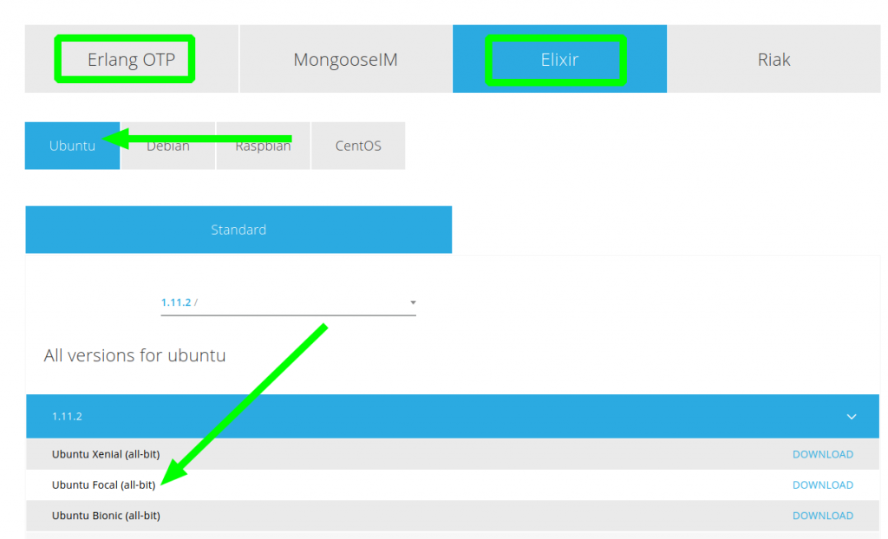
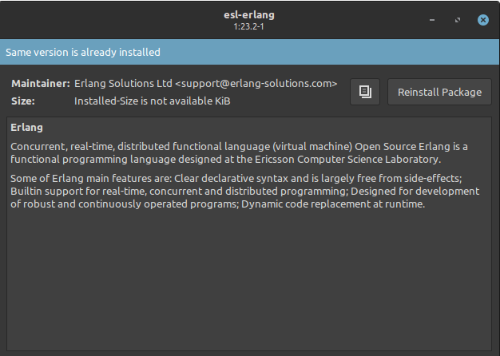
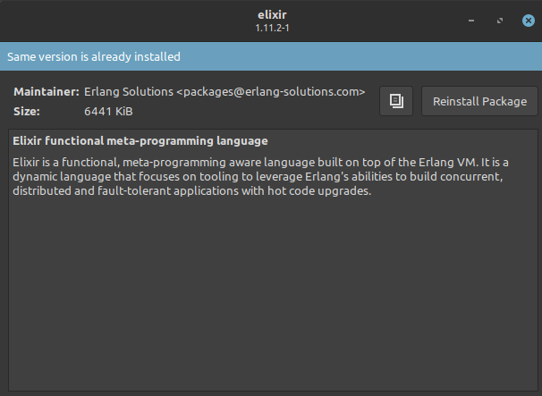
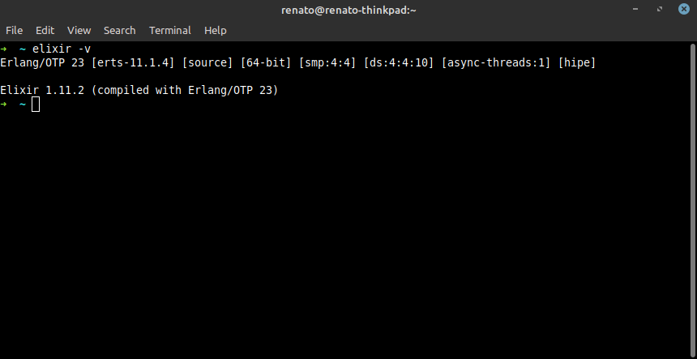

Since last weekend I'm using Linux Mint 20 instead of Windows 10. Today, I tried to install Elixir using the Ubuntu instructions using _apt get_, without success.

So I went with the package approach:

1. Direct download from Erlang Solutions ([link](https://www.erlang-solutions.com/resources/download.html))
2. Installation of the deb files using the software manager

In details, download Erlang and Elixir for Ubuntu Focal (20.04) which is the version used by Linux Mint 20.

Open each deb file and install it with software manager:

To confirm it is working OK, open a terminal and type `elixir -v`:

Easy-peasy.

