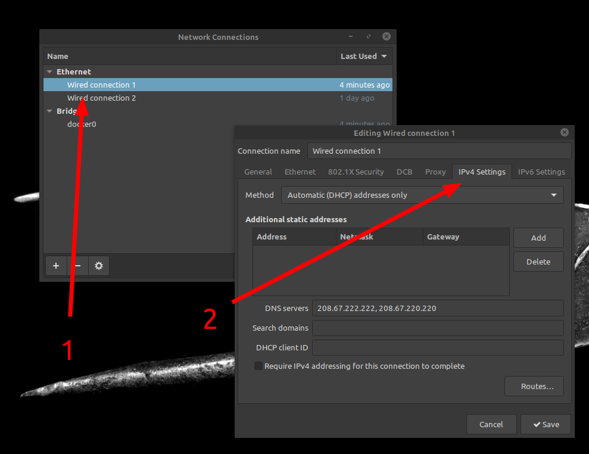

I’ve just moved to Linux Mint 20 from Windows 10, as mentioned before.

One of the things I felt was worse was the time internet pages were taking to load or “establishing connection…”.

It is a very strange problem and hard for me to debug.

Found a YouTube video explaining how to use OpenDNS to improve internet connection, so I decided to give it a try.

The steps are:

1. Go to [opendns.com](http://opendns.com) and copy the addresses at the bottom of the page
2. Open “Advanced Network Configurations”
3. Double your internet connection (in my case, “Wired connection 1”)
4. Go to the IPv4 tab and on the DNS servers field past the IP addresses copied from [opendns.com](http://opendns.com)
5. Press “Save” and reboot

Step 1

Steps 3 and 4
