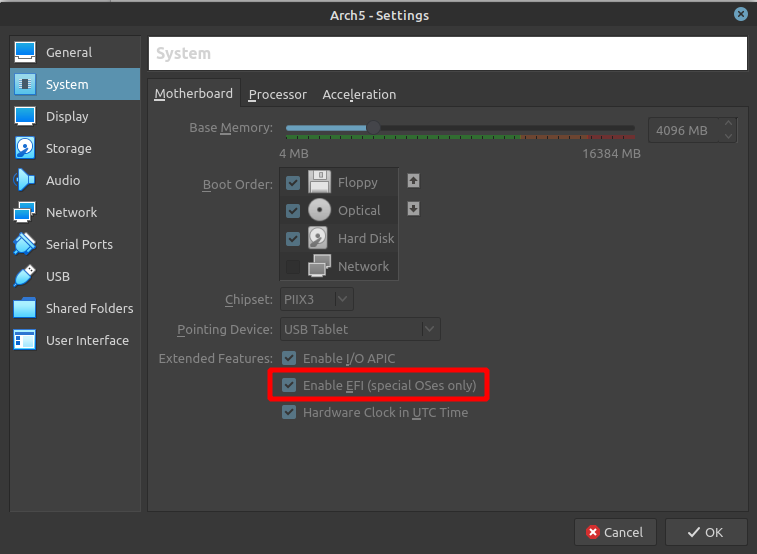

I'm learning about Arch Linux so I can install it on a custom build desktop.

I'll do that by doing an installation using VirtualBox.

It took me eight attempts to stabilize the script below.

Start by downloading ISO, e.g., from [this mirror in Portugal](https://ftp.rnl.tecnico.ulisboa.pt/pub/archlinux/iso/2021.03.01).

Next open VirtualBox and create a new machine using the image.

Before starting the machine, activate [EFI](https://en.wikipedia.org/wiki/EFI_system_partition) 
in the motherboard settings:



Start the virtual machine and follow the steps below.

Activate the Portuguese keyboard layout, check if networking is working, and update the system clock:

```bash
loadkeys pt-latin1
ip link
ping archlinux.org
timedatectl set-ntp true
```

Next, create the partitions using `fdisk`.


The first one is for EFI:

```bash
fdisk -l
fdisk /dev/sda
n
default
default
default
+512M
t
L # check for EFI
ef
```

The second for swap:

```bash
n
default
default
default
+1024M
t
default
L # check for Linux swap
82
```

The third for data/software:

```bash
n
default
default
default
default
w
```

After the partition creation:

```bash
mkfs.fat -F32 /dev/sda1
mkswap /dev/sda2
swapon /dev/sda2
mkfs.ext4 /dev/sda3
mount /dev/sda3 /mnt
pacstrap /mnt base linux linux-firmware vim
genfstab -U /mnt >> /mnt/etc/fstab
```

With the base setup done, let's set up the locale:

```bash
arch-chroot /mnt
ln -sf /usr/share/zoneinfo/Europe/Lisbon /etc/localtime
hwclock --systohc
vi /etc/locale.gen # uncomment pt_PT and en_GB ones
:x
locale-gen
```

Now set the network:

```bash
vi /etc/hostname
arch8 # the name you want
:x
vi /etc/hosts
127.0.0.1	localhost
::1		localhost
127.0.0.1	arch8.localdomain	arch8 # the name you want
:x
pacman -S networkmanager gnome-keyring
systemctl enable NetworkManager.service 
```

Change the root password:

```
passwd
```

And configure the bootloader:

```bash
pacman -S grub efibootmgr
mkdir /boot/efi
mount /dev/sda1 /boot/efi
grub-install --target=x86_64-efi --bootloader-id=GRUB --efi-directory=/boot/efi
grub-mkconfig -o /boot/grub/grub.cfg
```

To finish, install the desktop environment, with the bare minimum applications:

```bash
pacman -S xorg 
pacman -S gnome-shell nautilus gnome-terminal guake \
          gnome-tweak-tool gnome-control-center xdg-user-dirs gdm
systemctl enable gdm.service
```

Finish by rebooting:
```bash
exit
reboot
```
